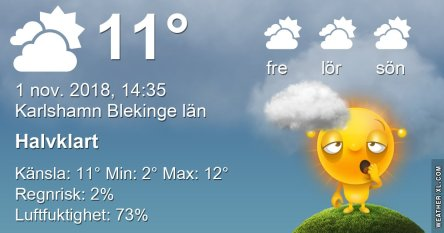
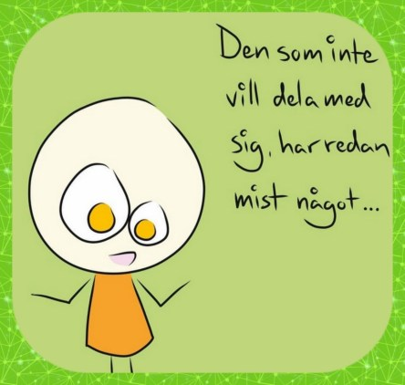
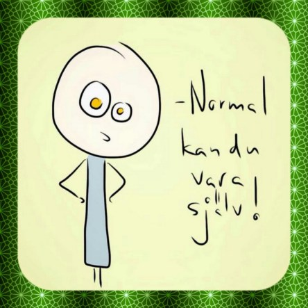

Idag går solen upp 07:08 och ned 16:20. Dagens längd är 9 timmar och 12 minuter. Det är gryning 06:28 och skymning 17:00 Det är dagsljus 10 timmar och 32 minuter. Månen går upp 23:50 och ned 14:30 Månen är belyst 46 %.

 Mest molnigt 3,4 C  Vindby 0,3 m/s NW  Luftfuktighet 93 %  hPa 1018 Kl.01:55

 Växlande molnighet och dimma 3,6 C  Vindby 1 m/s SW  Luftfuktighet 94 %  hPa 1017 Kl.06:35

 Mest molnigt 13,1 C  Vindby 2,8 m/s S  Luftfuktighet 72 %  hPa 1012 Kl.14:15

 Molnigt 7,3 C  Vindby 1,2 m/s ENE  Luftfuktighet 88 %  hPa 1009 Kl.19:50

 Grått och dimmigt på morgonen och bara någon solglimt på dagen.

Högst och lägst uppmätta temperatur igår (inofficiellt privat mätare): Max 12,3 C , Min 2,6 C Högst uppmätta vind 4,8 m/s, Högst uppmätta vindby 8,8 m/s

Högst och lägst uppmätta temperatur igår (officiellt enligt [YR.NO](http://www.vackertvader.se/v%C3%A4derstation/karlshamn?utm_source=email&utm_medium=email&utm_campaign=asarum)) Max 11,2 C, Min 2 C Högst uppmätta vind 3,9 m/s. Högst uppmätta vindby 11,2 m/s

 Det var en dimmig morgon idag.

 Några roliga, kloka och tänkvärda ord till kvällen.

 och

 och sov gott.
