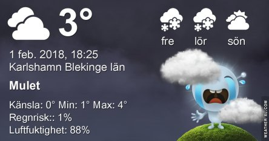
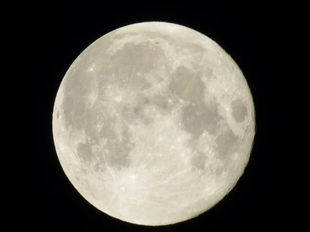
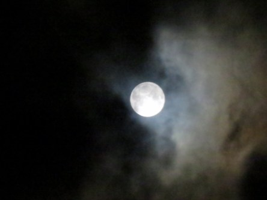
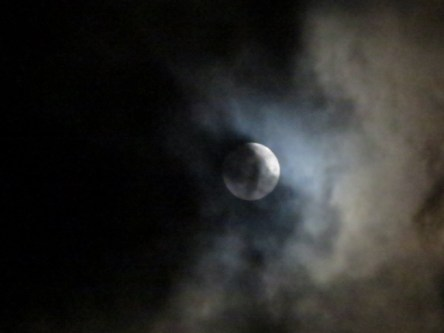

Idag går solen upp 07:57 och ned 16:32. Månen går upp 17:57 och ned 08:26 Månen är belyst 100 %. Dagens längd är 8 timmar och 35 minuter

 Växlande molnighet 2,8 C  Vindby 3,1 m/s N  Luftfuktighet 96 %  hPa 986 Kl.01:55

 Mest molnigt 1,8 C  Vindby 1,7 m/s N  Luftfuktighet 84 %  hPa 986 Kl.06:50

 Molnigt 3,9 C  Vindby 3,6 m/s ESE  Luftfuktighet 77 %  hPa 990 Kl.14:30

 Mest molnigt 2,4 C  Vindby 1,2 m/s SSE  Luftfuktighet 87 %  hPa 992 Kl.20:05

 Usch, nu kommer kylan med minusgrader dygnet runt.

Högst och lägst uppmätta temperatur igår (inofficiellt privat mätare): Max 5,7 C , Min 2,7 C Högst uppmätta vind 4,1 m/s. Högst uppmätta vindby 10,4 m/s.

Högst och lägst uppmätta temperatur igår (officiellt enligt [YR.NO](http://www.vackertvader.se/v%C3%A4derstation/karlshamn?utm_source=email&utm_medium=email&utm_campaign=asarum)) Max ? C, Min ? C Högst uppmätta vind ? m/s. Högst uppmätta vindby ? m/s

 Inatt var det fullmåne och kameran var med. Inte helt skarpa bilder på grund av att det var ett tunt molntäcke och inget stativ. Jag satt i min arbetsbil och tog bilderna 😀
