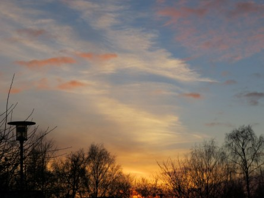
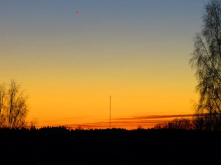

Idag går solen upp 05:16 och ned 20:39. Månen går upp 22:10 och ned 06:28 Månen är belyst 99 %. Dagens längd är 15 timmar och 23 minuter

 Molnigt 6,4 C  Vindby 0,4 m/s W  Luftfuktighet 97 %  hPa 999 Kl.01:35

 Växlande molnighet 7,5 C  Vindby 0,7 m/s E  Luftfuktighet 97 %  hPa 998 Kl.07:25

 Växlande molnighet 17,2 C  Vindby 4,4 m/s NW  Luftfuktighet 54 %  hPa 1000 Kl.13:55

 Molnigt och lätt regn 6,9 C  Vindby 5,4 m/s NW  Luftfuktighet 85 %  hPa 1001 Kl.19:45

 Just nu är jag trött på blåst och grått väder och trött på att inte kunna gå utan hjälp 😩  😢

Högst och lägst uppmätta temperatur igår (inofficiellt privat mätare): Max 19,3 C , Min 5,3 C Högst uppmätta vind 6,5 m/s. Högst uppmätta vindby 13,6 m/s.

Högst och lägst uppmätta temperatur igår (officiellt enligt [YR.NO](http://www.vackertvader.se/v%C3%A4derstation/karlshamn?utm_source=email&utm_medium=email&utm_campaign=asarum)) Max 17,1 C, Min 6 C Högst uppmätta vind 5,6 m/s. Högst uppmätta vindby 15,3 m/s

 Tills jag kan ta nya bilder så får arkivet rycka in igen. Här några bilder på soluppgångar och fullmåne från december förra året.
