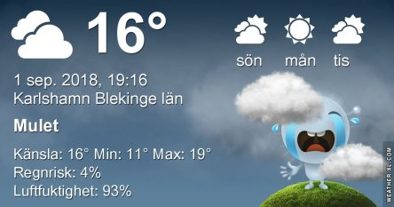
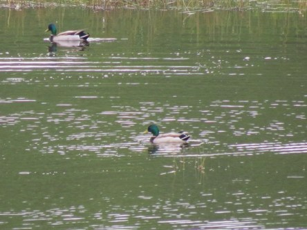
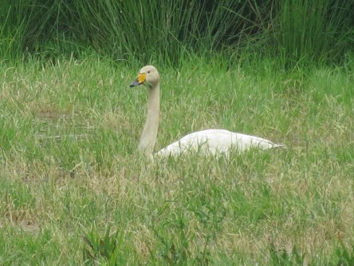

Idag går solen upp 06:04 och ned 19:56. Dagens längd är 13 timmar och 52 minuter. Det är gryning 05:24 och skymning 20:35 Det är dagsljus 15 timmar och 11 minuter. Månen går upp 22:28 och ned 11:37 Månen är belyst 71 %.

 Molnigt 13,5 C  Vindby 1,6 m/s ENE  Luftfuktighet 92 %  hPa 1014 Kl.02:35

 Molnigt 13,3 C  Vindby 0,7 m/s SE  Luftfuktighet 94 %  hPa 1015 Kl.06:40

 Molnigt 20,4 C  Vindby 2 m/s N  Luftfuktighet 84 %  hPa 1019 Kl.14:30

 Mest molnigt 16,2 C  Vindstilla  Luftfuktighet 88 %  hPa 1021 Kl.19:50

 Hur mycket regn som än lovas så får vi knappt något av det.

Högst och lägst uppmätta temperatur igår (inofficiellt privat mätare): Max 20,8 C , Min 13,8 C Högst uppmätta vind 2,7 m/s. Högst uppmätta vindby 4,4 m/s

Högst och lägst uppmätta temperatur igår (officiellt enligt [YR.NO](http://www.vackertvader.se/v%C3%A4derstation/karlshamn?utm_source=email&utm_medium=email&utm_campaign=asarum)) Max 18 C, Min 14,1 C Högst uppmätta vind 4,3 m/s. Högst uppmätta vindby 9,3 m/s

 Idag har jag ägnat mig åt det föga lockande arbetet med att börja höststäda både förråd och trädgård. Mycket har halkat efter efter den extremt varma och långa sommaren då man inte orkat göra någonting annat än att sitta och pusta. Så därför har arkivet fått rycka in igen med lite blandade bilder.
