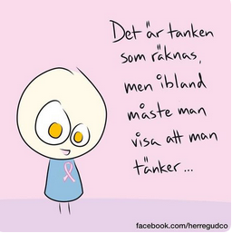

Idag går solen upp 07:22 och ned 18:13. Dagens längd är 10 timmar och 51 minuter. Det är gryning 06:44 och skymning 18:50 Det är dagsljus 12 timmar och 06 minuter. Månen går upp 08:38 och ned 19:09 Månen är belyst 1 %.

 Mest molnigt 7 C  Vindstilla  Luftfuktighet 95 %  hPa 1016 Kl.02:20

 Dimma 4,9 C  Vindstilla  Luftfuktighet 97 %  hPa 1018 Kl.07:05

 Tunna slöjmoln 22,1 C  Vindby 1,8 m/s NNE  Luftfuktighet 53 %  hPa 1020 Kl.14:20

 Mest klart 6,9 C  Vindstilla  Luftfuktighet 91 %  hPa 1021 Kl.19:40

 Vilken härlig dag det har varit här idag. Det kom upp över 20 grader i solen. Men nu sjunker det snabbt så det lär bli en kylig natt.

Högst och lägst uppmätta temperatur igår (inofficiellt privat mätare): Max 19,2 C , Min 8,3 C Högst uppmätta vind 2,7 m/s, Högst uppmätta vindby 4,1 m/s

Högst och lägst uppmätta temperatur igår (officiellt enligt [YR.NO](http://www.vackertvader.se/v%C3%A4derstation/karlshamn?utm_source=email&utm_medium=email&utm_campaign=asarum)) Max 12,6 C, Min  0,8 C Högst uppmätta vind 3 m/s. Högst uppmätta vindby 9,8 m/s

 Här kommer fler tänkvärda ord som jag tycker är väldigt bra.
