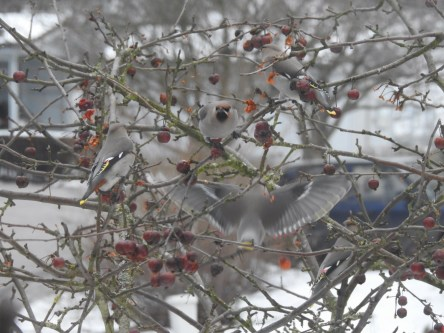
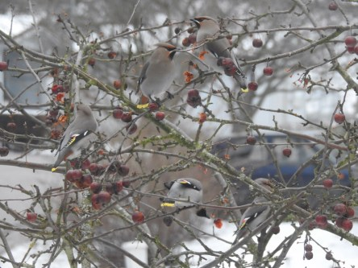
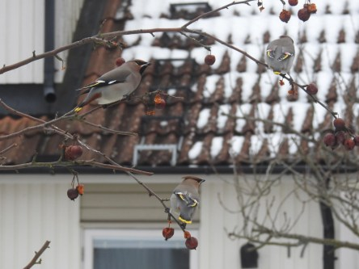
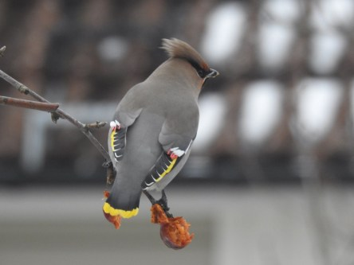

Idag går solen upp 07:38 och ned 16:52. Månen går upp 03:52 och ned 12:02 Månen är belyst 28 %. Dagens längd är 9 timmar och 14 minuter

 Molnigt 0,2 C  Vindby 2,4 m/s NW  Luftfuktighet 74 %  hPa 1014 Kl.02:20

 Molnigt - 0,3 C  Vindby 2,2 m/s NE  Luftfuktighet 76 %  hPa 1013 Kl.06:55

 Molnigt 1,3 C  Vindby 2,4 m/s NNE  Luftfuktighet 74 %  hPa 1011 Kl.13:30

 Molnigt - 1,7 C  Vindby 1,7 m/s NW  Luftfuktighet 77 %  hPa 1009 Kl.19:45

 En helt vanlig grå dag igen.

Högst och lägst uppmätta temperatur igår (inofficiellt privat mätare): Max 6,1 C , Min – 10,6 C Högst uppmätta vind 2,7 m/s. Högst uppmätta vindby 4,8 m/s.

Högst och lägst uppmätta temperatur igår (officiellt enligt [YR.NO](http://www.vackertvader.se/v%C3%A4derstation/karlshamn?utm_source=email&utm_medium=email&utm_campaign=asarum)) Max 2,3 C, Min – 10,9 C Högst uppmätta vind 3,5 m/s. Högst uppmätta vindby 7 m/s

 Rena invasionen av sidensvansar idag.
