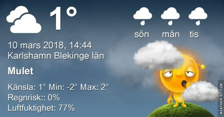

Idag går solen upp 06:30 och ned 17:52. Månen går upp 02:41 och ned 10:37 Månen är belyst 45 %. Dagens längd är 11 timmar och 22 minuter

 Molnigt - 1,7 C  Vindby 2,6 m/s NE  Luftfuktighet 80 %  hPa 1001 Kl.02:05

 Molnigt - 2,7 C  Vindby 2 m/s W  Luftfuktighet 78 %  hPa 1002 Kl.06:40

 Mest molnigt med en del sol 10,1 C ( i solen )  Vindby 3,8 m/s W  Luftfuktighet 60 %  hPa 1003 Kl.14:05

 Molnigt - 2,7 C  Vindstilla  Luftfuktighet 76 %  hPa 1004 Kl.19:45

 Vad jag längtar till våren och blomningen nu.

Högst och lägst uppmätta temperatur igår (inofficiellt privat mätare): Max 5,1 C , Min – 0,9 C Högst uppmätta vind 2 m/s. Högst uppmätta vindby 3,4 m/s.

Högst och lägst uppmätta temperatur igår (officiellt enligt [YR.NO](http://www.vackertvader.se/v%C3%A4derstation/karlshamn?utm_source=email&utm_medium=email&utm_campaign=asarum)) Max 2,5 C, Min – 0,6 C Högst uppmätta vind 3,7 m/s. Högst uppmätta vindby 6,8 m/s

 I brist på vår så har jag plockat fram äldre vårbilder. Dessa bilder är tagna i April och Maj 2014. Överst en stare. Därefter pappa Hacke, gråsparv och pilfink. Som avslutning ett par tulpaner.
