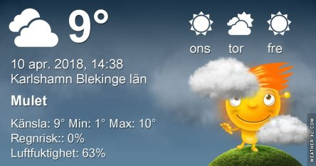

Idag går solen upp 06:08 och ned 19:56. Månen går upp 04:29 och ned 13:04 Månen är belyst 34 %. Dagens längd är 13 timmar och 48 minuter

 Mest molnigt 8,1 C  Vindby 4,1 m/s SE  Luftfuktighet 84 %  hPa 1005 Kl.02:30

 Molnigt 3,3 C  Vindby 4 m/s NE  Luftfuktighet 91 %  hPa 1009 Kl.06:25

 Tunna slöjmoln 12,9 C  Vindby 4,4 m/s WNW  Luftfuktighet 64 %  hPa 1013 Kl.13:00

 Växlande molnighet 2,3 C  Vindby 4,1 m/s SE  Luftfuktighet 61 %  hPa 1016 Kl.21:10

 Idag har det varit blåsigt och soligt men inte alls lika varmt som igår.

Högst och lägst uppmätta temperatur igår (inofficiellt privat mätare): Max 25,6 C , Min – 1,5 C Högst uppmätta vind 2,4 m/s. Högst uppmätta vindby 3,4 m/s.

Högst och lägst uppmätta temperatur igår (officiellt enligt [YR.NO](http://www.vackertvader.se/v%C3%A4derstation/karlshamn?utm_source=email&utm_medium=email&utm_campaign=asarum)) Max 20 C, Min – 1 C Högst uppmätta vind 2,7 m/s. Högst uppmätta vindby 6,4 m/s

 I brist på tid för att ta bilder idag så får arkivet rycka in igen. Detta är två äldre bilder jag tagit på ett litet rådjurskid och en på pappa Hacke.
