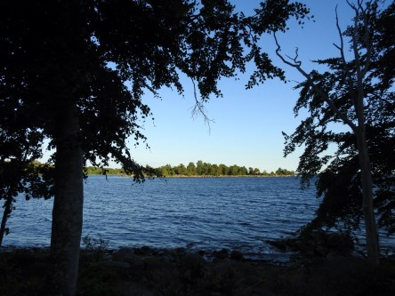
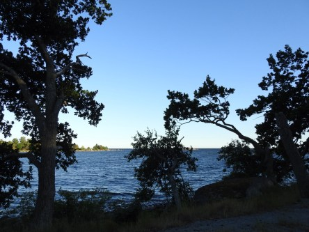

Idag går solen upp 04:14 och ned 21:46. Månen går upp 03:04 och ned 17:00 Månen är belyst 18 %. Dagens längd är 17 timmar och 32 minuter

 Växlande molnighet 10,1 C  Vindstilla  Luftfuktighet 97 %  hPa 1010 Kl.01:50

 Halvklart 24,8 C  Vindby 1,4 m/s E  Luftfuktighet 58 %  hPa 1008 Kl.08:15

 Mest molnigt 29,2 C  Vindby 3,6 m/s SSW  Luftfuktighet 47 %  hPa 1006 Kl.13:30

 Mest molnigt 21,3 C  Vindby 0,6 m/s E  Luftfuktighet 63 %  hPa 1004 Kl.19:55

 Värmen håller sitt grepp om oss.

Högst och lägst uppmätta temperatur igår (inofficiellt privat mätare): Max 32,7 C ( i solen ), Min 9,5 C Högst uppmätta vind 2 m/s. Högst uppmätta vindby 7 m/s

Högst och lägst uppmätta temperatur igår (officiellt enligt [YR.NO](http://www.vackertvader.se/v%C3%A4derstation/karlshamn?utm_source=email&utm_medium=email&utm_campaign=asarum)) Max 23,7 C, Min 6,8 C Högst uppmätta vind 4,7 m/s. Högst uppmätta vindby 7,9 m/s

 Några kvällsbilder från havet ute i Vettekulla.
