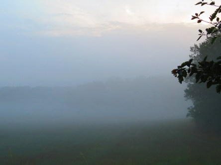
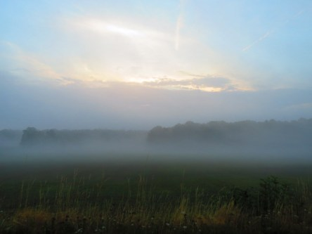
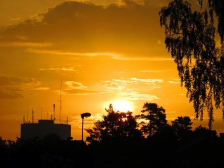

Idag går solen upp 05:21 och ned 20:50. Dagens längd är 15 timmar och 29 minuter. Det är gryning 04:35 och skymning 21:35 Det är dagsljus 17 timmar och 00 minuter. Månen går upp 03:48 och ned 20:18 Månen är belyst 3 %.

 Molnigt och åska 20,9 C  Vindby 5,4 m/s SE  Luftfuktighet 85 %  hPa 1005 Kl.02:25

 Uppsprickande molntäcke 21,1 C  Vindby 2,8 m/s WSW  Luftfuktighet 95 %  hPa 1005  Regn 5 mm Kl.07:10

 Stackmoln och blåsigt 27,5 C  Vindby 7,6 m/s SSE  Luftfuktighet 40 %  hPa 1011 Kl.15:35

 Växlande molnighet 19 C  Vindby 1,6 m/s NNW  Luftfuktighet 46 %  hPa 1014 Kl.20:00

 Äntligen lite mer normala temperaturer och molnigt. Skönt.

Högst och lägst uppmätta temperatur igår (inofficiellt privat mätare): Max 34,4 C ( i solen ), Min 18,5 C Högst uppmätta vind 2,7 m/s. Högst uppmätta vindby 5,4 m/s

Högst och lägst uppmätta temperatur igår (officiellt enligt [YR.NO](http://www.vackertvader.se/v%C3%A4derstation/karlshamn?utm_source=email&utm_medium=email&utm_campaign=asarum)) Max 26,8 C, Min 17,5 C Högst uppmätta vind 4,3 m/s. Högst uppmätta vindby 8,4 m/s

 Dimman låg tät på morgonen efter regnet och åskan. Men det hindrade inte solen från att tränga sig fram bland molnen. Men idag lyckades hon inte fullt ut för molnen gav inte upp.

 Så här dramatisk är himlen just nu.
