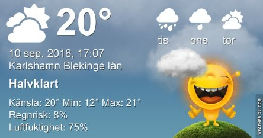

Idag går solen upp 06:22 och ned 19:32. Dagens längd är 13 timmar och 10 minuter. Det är gryning 05:43 och skymning 20:10 Det är dagsljus 14 timmar och 27 minuter. Månen går upp 06:56 och ned 20:08 Månen är belyst 0 %.

 Mest klart 9,2 C  Vindstilla  Luftfuktighet 98 %  hPa 1017 Kl.02:15

 Växlande molnighet 9,9 C  Vindstilla  Luftfuktighet 97 %  hPa 1015 Kl.06:50

 Molnigt 23,6 C  Vindby 2,2 m/s S  Luftfuktighet 68 %  hPa 1013 Kl.13:55

 Molnigt 15,6 C  Vindby 0,8 m/s W  Luftfuktighet 69 %  hPa 1013 Kl.19:45

 Nu återstår det att se om det kommer något regn.

Högst och lägst uppmätta temperatur igår (inofficiellt privat mätare): Max 25,7 C , Min 9,4 C Högst uppmätta vind 2,4 m/s. Högst uppmätta vindby 5,8 m/s

Högst och lägst uppmätta temperatur igår (officiellt enligt [YR.NO](http://www.vackertvader.se/v%C3%A4derstation/karlshamn?utm_source=email&utm_medium=email&utm_campaign=asarum)) Max 20,5 C, Min 9,1 C Högst uppmätta vind 3,9 m/s. Högst uppmätta vindby 8,7 m/s

 Fler kloka ord från Pinterest.
