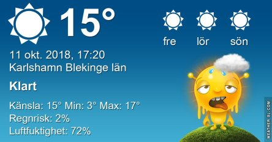

Idag går solen upp 07:24 och ned 18:10. Dagens längd är 10 timmar och 46 minuter. Det är gryning 06:46 och skymning 18:48 Det är dagsljus 12 timmar och 02 minuter. Månen går upp 09:57 och ned 19:30 Månen är belyst 5 %.

 Klart 3,4 C  Vindstilla  Luftfuktighet 97 %  hPa 1022 Kl.02:05

 Mest klart 6,3 C  Vindby 1,4 m/s SW  Luftfuktighet 98 %  hPa 1020 Kl.06:55

 Mest klart 19,6 C  Vindby 4,4 m/s E  Luftfuktighet 60 %  hPa 1019 Kl.13:40

 Mest klart 10,3 C  Vindby 1,4 m/s N  Luftfuktighet 79 %  hPa 1018 Kl.19:45

 Pust vad varmt det blev idag! Riktig sommarvärme igen.

Högst och lägst uppmätta temperatur igår (inofficiellt privat mätare): Max 22,2 C , Min 3,5 C Högst uppmätta vind 1,4 m/s, Högst uppmätta vindby 2 m/s

Högst och lägst uppmätta temperatur igår (officiellt enligt [YR.NO](http://www.vackertvader.se/v%C3%A4derstation/karlshamn?utm_source=email&utm_medium=email&utm_campaign=asarum)) Max 17,4 C, Min  2,4 C Högst uppmätta vind 2,3 m/s. Högst uppmätta vindby 4,7 m/s

 I brist på tid och ork blir det några fler av de här idag igen.
