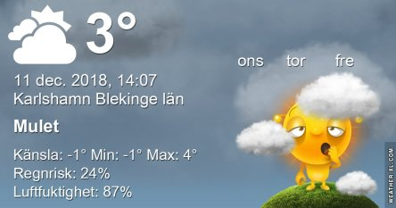
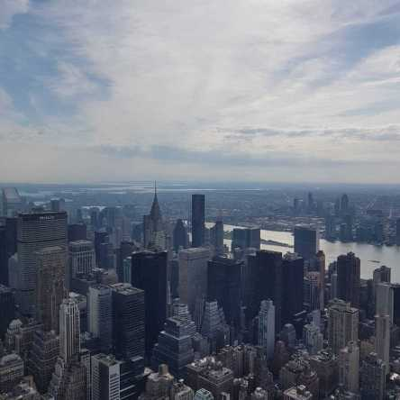

Idag går solen upp 08:23 och ned 15:25 Dagens längd är 7 timmar och 2 minuter. Det är gryning 07:36 och skymning 16:12 Det är dagsljus 8 timmar och 36 minuter. Månen går upp 11:24 och ned 19:18 Månen är belyst 13 %.

 Molnigt - 0,1 C  Vindby 3,4 m/s S  Luftfuktighet 76 %  hPa 1002 Kl.02:20

 Mest molnigt 0,6 C  Vindby 1,8 m/s WNW  Luftfuktighet 82 %  hPa 1006 Kl.07:25

 Molnigt 4,8 C  VindbY 2,2 m/s W  Luftfuktighet 76 %  hPa 1011 Kl.13:35

 Växlande molnighet 2,5 C  Vindby 3,6 m/s NE  Luftfuktighet 80 %  hPa 1017 Kl.21:20

 Då var gråvädret tillbaks igen! Men det kom i alla fall några vita flingor inatt. De försvann lika fort igen dock men lyste upp lite för en kort stund ändå.

Högst och lägst uppmätta temperatur igår (inofficiellt privat mätare) Max 5,6 C , Min - 2,7 C Högst uppmätta vind 2 m/s, Högst uppmätta vindby 3,4 m/s

Högst och lägst uppmätta temperatur igår (officiellt enligt [YR.NO](http://www.vackertvader.se/v%C3%A4derstation/karlshamn?utm_source=email&utm_medium=email&utm_campaign=asarum)) Max 4,3 C, Min - 0,6 C Högst uppmätta vind 3 m/s. Högst uppmätta vindby 7,3 m/s

\[gallery type="rectangular" link="file" size="medium" ids="25924,25925,25926,25927,25928,25929,25930,25931,25932,25933,25934,25935,25936,25937,25938"\]

Lek med en och samma bild med flera olika filter. Tycker det är roligt att se hur olika bilderna kan bli trotts att det är samma bild hela tiden.

 Så här ser originalet ut.
