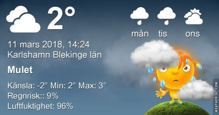
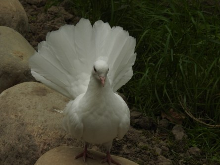

Idag går solen upp 06:27 och ned 17:54. Månen går upp 03:34 och ned 11:22 Månen är belyst 36 %. Dagens längd är 11 timmar och 27 minuter

 Molnigt - 1,2 C  Vindby 4,6 m/s ENE  Luftfuktighet 83 %  hPa 1002 Kl.01:25

 Molnigt 1 C  Vindby 0,7 m/s E  Luftfuktighet 94 %  hPa 1000 Kl.08:00

 Duggregn 3,3 C  Vindby 4,1 m/s SE  Luftfuktighet 95 %  hPa 997  Snö/regn 4,8 mm Kl.13:35

 Dimma 1,7 C  Vindby 2,4 m/s ESE  Luftfuktighet 97 %  hPa 997 Kl.19:55

 Grått, dimma och regn har präglat dagen.

Högst och lägst uppmätta temperatur igår (inofficiellt privat mätare): Max 10,1 C ( i solen ) , Min – 2,9 C Högst uppmätta vind 1,7 m/s. Högst uppmätta vindby 3,1 m/s.

Högst och lägst uppmätta temperatur igår (officiellt enligt [YR.NO](http://www.vackertvader.se/v%C3%A4derstation/karlshamn?utm_source=email&utm_medium=email&utm_campaign=asarum)) Max 2 C, Min – 2,1 C Högst uppmätta vind 2,5 m/s. Högst uppmätta vindby 5,8 m/s

 Istället för vit snö som jag fått nog av nu så väljer jag en vit duva idag.
