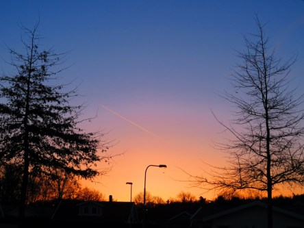

Idag går solen upp 06:05 och ned 19:58. Månen går upp 04:57 och ned 14:12 Månen är belyst 25 %. Dagens längd är 13 timmar och 53 minuter

 Klart - 0,2 C  Vindby 3 m/s NW  Luftfuktighet 73 %  hPa 1017 Kl.02:20

 Mest klart 0,9 C  Vindby 5,8 m/s E  Luftfuktighet 81 %  hPa 1016 Kl.07:00

 Tunna slöjmoln 16,2 C  Vindby 6,8 m/s E  Luftfuktighet 25 %  hPa 1016 Kl.13:15

 Höga moln 4,4 C  Vindby 3,6 m/s NNW  Luftfuktighet 54 %  hPa 1016 Kl.20:00

 Ytterligare en blåsig men ganska solig och varm dag.

Högst och lägst uppmätta temperatur igår (inofficiellt privat mätare): Max 13,4 C , Min 1,8 C Högst uppmätta vind 4,4 m/s. Högst uppmätta vindby 7,8 m/s.

Högst och lägst uppmätta temperatur igår (officiellt enligt [YR.NO](http://www.vackertvader.se/v%C3%A4derstation/karlshamn?utm_source=email&utm_medium=email&utm_campaign=asarum)) Max 10,9 C, Min 1,5 C Högst uppmätta vind 4,6 m/s. Högst uppmätta vindby 11,2 m/s

 Dagens soluppgång från några olika platser.
