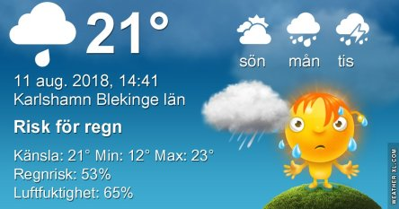
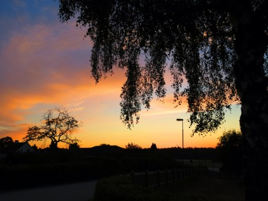

Idag går solen upp 05:23 och ned 20:48. Dagens längd är 15 timmar och 25 minuter. Det är gryning 04:37 och skymning 21:33 Det är dagsljus 16 timmar och 56 minuter. Månen går upp 05:09 och ned 20:54 Månen är belyst 0 %.

 Mest klart 10,8 C  Vindstilla  Luftfuktighet 82 %  hPa 1015 Kl.01:50

 Växlande molnighet 10,3 C  Vindby 0,3 m/s WNW  Luftfuktighet 94 %  hPa 1014 Kl.06:20

 Växlande molnighet 24,8 C  Vindby 6,8 m/s ESE  Luftfuktighet 54 %  hPa 1009  Regn 2,2 mm Kl.14:40

 Växlande molnighet 16,1 C  Vindby 2,4 m/s ENE  Luftfuktighet 58 %  hPa 1007 Kl.19:50

 Idag kom det lite regn igen, väldigt lite. Och det åskade en stund på förmiddagen.

Högst och lägst uppmätta temperatur igår (inofficiellt privat mätare): Max 28,6 C ( i solen ), Min 13,5 C Högst uppmätta vind 5,8 m/s. Högst uppmätta vindby 8,4 m/s

Högst och lägst uppmätta temperatur igår (officiellt enligt [YR.NO](http://www.vackertvader.se/v%C3%A4derstation/karlshamn?utm_source=email&utm_medium=email&utm_campaign=asarum)) Max 25,2 C, Min 12,8 C Högst uppmätta vind 4,3 m/s. Högst uppmätta vindby 13,4 m/s

 Efter en riktigt sval natt med 8,9 grader så gick solen upp igen. Men idag har hon varit lite mer skonsam och hållit mer normala temperaturer. Och det har både åskat, regnat lite och varit blåsigt.
