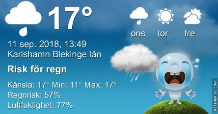
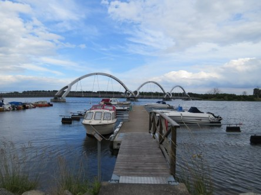
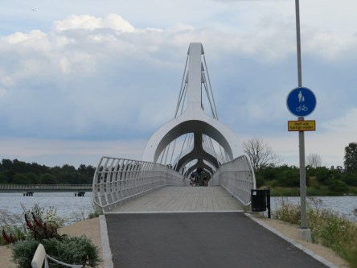
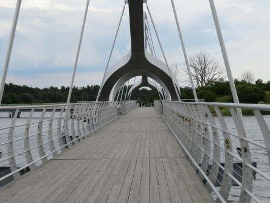
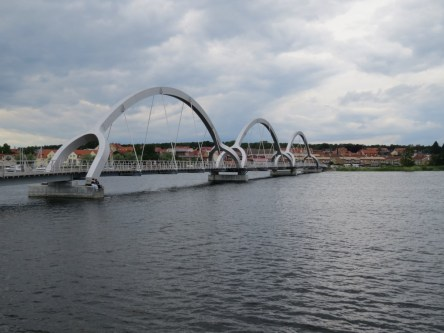
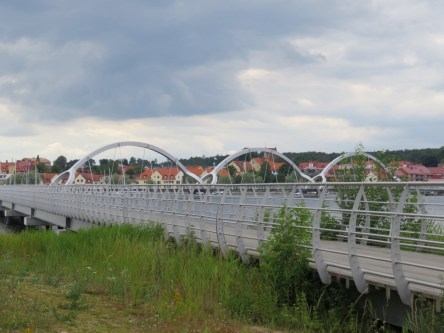
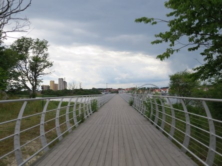

Idag går solen upp 06:24 och ned 19:29. Dagens längd är 13 timmar och 05 minuter. Det är gryning 05:45 och skymning 20:08 Det är dagsljus 14 timmar och 23 minuter. Månen går upp 08:21 och ned 20:27 Månen är belyst 3 %.

 Molnigt 10,2 C  Vindstilla  Luftfuktighet 95 %  hPa 1014 Kl.02:30

 Molnigt 10,6 C  Vindstilla  Luftfuktighet 97 %  hPa 1012 Kl.06:40

 Molnigt 19,7 C  Vindby 2,4 m/s SE  Luftfuktighet 74 %  hPa 1009 Kl.13:45

 Molnigt och lätt regn 15,2 C  Vindby 1,7 m/s E  Luftfuktighet 91 %  hPa 1007  Regn 4,5 mm Kl.21:10

 Det kom lite regn idag men mycket mer behövs!

Högst och lägst uppmätta temperatur igår (inofficiellt privat mätare): Max 23,6 C , Min 9,3 C Högst uppmätta vind 2,4 m/s. Högst uppmätta vindby 3,7 m/s

Högst och lägst uppmätta temperatur igår (officiellt enligt [YR.NO](http://www.vackertvader.se/v%C3%A4derstation/karlshamn?utm_source=email&utm_medium=email&utm_campaign=asarum)) Max 21,6 C, Min 8,4 C Högst uppmätta vind 2,9 m/s. Högst uppmätta vindby 6,3 m/s

 Några arkivbilder på den vackra Sölvesborgsbron.
