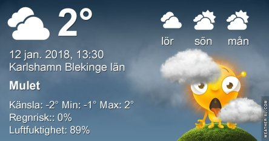

Idag går solen upp 08:26 och ned 15:51. Månen går upp 03:54 och ned 12:58 Månen är belyst 21 %. Dagens längd är 7 timmar och 25 minuter

 Molnigt 1,1 C  Vindby 5,4 m/s SSE  Luftfuktighet 82 %  hPa 1024 Kl.01:15

 Molnigt 0,6 C  Vindby 6,2 m/s NW  Luftfuktighet 82 %  hPa 1027 Kl.06:25

 Molnigt och en del snö 1,9 C  Vindby 4,8 m/s NW  Luftfuktighet 87 %  hPa 1030 Kl.13:50

 Molnigt 0,1 C  Vindby 4,8 m/s E  Luftfuktighet 95 %  hPa 1032 Kl.20:00

 Grått, regn och snö om vartannat.

Högst och lägst uppmätta temperatur igår (inofficiellt privat mätare): Max 2,9 C , Min 1,3 C Högst uppmätta vind 3,1 m/s. Högst uppmätta vindby 7,8 m/s.

Högst och lägst uppmätta temperatur igår (officiellt enligt [YR.NO](http://www.vackertvader.se/v%C3%A4derstation/karlshamn?utm_source=email&utm_medium=email&utm_campaign=asarum)) Max 2,9 C, Min 1,6 C Högst uppmätta vind 2,5 m/s. Högst uppmätta vindby 7,1 m/s

 Den här krontranan från Gran Canaria får pigga upp en annars grå och tråkig dag.
