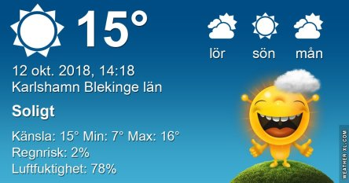
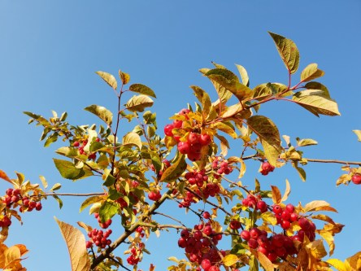
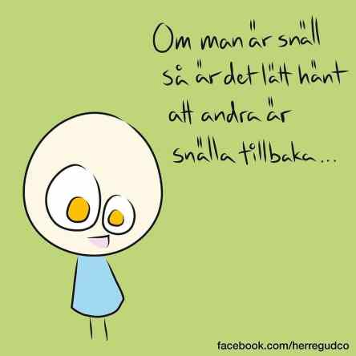

Idag går solen upp 07:26 och ned 18:08. Dagens längd är 10 timmar och 42 minuter. Det är gryning 06:48 och skymning 18:45 Det är dagsljus 11 timmar och 57 minuter. Månen går upp 11:13 och ned 19:55 Månen är belyst 10 %.

 Halvklart 10,6 C  Vindby 1,6 m/s SSE  Luftfuktighet 83 %  hPa 1017 Kl.01:10

 Dimma 7 C  Vindby 0,8 m/s E  Luftfuktighet 93 %  hPa 1017 Kl.06:55

 Klart 20,9 C  Vindby 1,8 m/s NE  Luftfuktighet 60 %   hPa 1019 Kl.14:05

 Klart 8,6 C  Vindstilla  Luftfuktighet 91 %  hPa 1019 Kl.20:00

 Ännu en härligt fin dag är till ända.

Högst och lägst uppmätta temperatur igår (inofficiellt privat mätare): Max 20,5 C , Min 3,3 C Högst uppmätta vind 3,4 m/s, Högst uppmätta vindby 5,1 m/s

Högst och lägst uppmätta temperatur igår (officiellt enligt [YR.NO](http://www.vackertvader.se/v%C3%A4derstation/karlshamn?utm_source=email&utm_medium=email&utm_campaign=asarum)) Max 16,6 C, Min  2 C Högst uppmätta vind 5,4 m/s. Högst uppmätta vindby 10,8 m/s

 Härliga höst med alla vackra färger.

 Också ännu fler av dessa kloka och tänkvärda ord!
