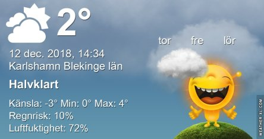
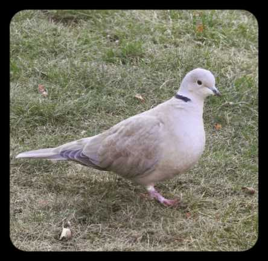

Idag går solen upp 08:24 och ned 15:24 Dagens längd är 7 timmar och 0 minuter. Det är gryning 07:37 och skymning 16:12 Det är dagsljus 8 timmar och 35 minuter. Månen går upp 11:52 och ned 20:24 Månen är belyst 20 %.

 Molnigt 0,5 C  Vindby 0,6 m/s W  Luftfuktighet 81 %  hPa 1020 Kl.02:30

 Halvklart - 0,5 C  Vindby 1 m/s N  Luftfuktighet 83 %  hPa 1022 Kl.07:00

 Växlande molnighet 3,2 C  Vindby 3 m/s NE  Luftfuktighet 69 %  hPa 1025 Kl.13:20

 Klart - 3,5 C  Vindby 0,8 m/s SSE  Luftfuktighet 82 %  hPa 1025 Kl.19:50

 Idag fick vi lite sol igen.

Högst och lägst uppmätta temperatur igår (inofficiellt privat mätare) Max 4,9 C , Min – 1,6 C Högst uppmätta vind 2,7 m/s, Högst uppmätta vindby 5,2 m/s

Högst och lägst uppmätta temperatur igår (officiellt enligt [YR.NO](http://www.vackertvader.se/v%C3%A4derstation/karlshamn?utm_source=email&utm_medium=email&utm_campaign=asarum)) Max 4 C, Min – 0,2 C Högst uppmätta vind 4,2 m/s. Högst uppmätta vindby 9,9 m/s

 Äntligen var det tillräckligt bra ljus för att kunna ta lite nya bilder på mina små middagsgäster. Här den lilla rödhaken som siktar in sig på maten och kastar sig iväg.

 Koltrasten passar på att sola sig när det för en gångs skull inte är gråväder.

 Idag fick jag besök av en turkduva som jag inte sett på länge.

 Idag flög F 17 över oss med sin årliga julgransformation. Tyvärr kom de 20 minuter för tidigt så jag var inte alls beredd med kameran och fick inga bilder på det. Så den här som jag hittat på nätet får duga för att visa hur det såg ut.
