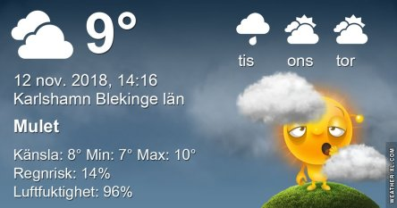
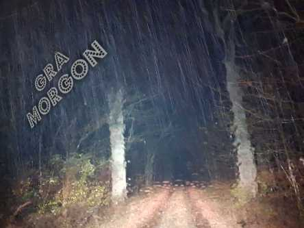

Idag går solen upp 07:31 och ned 15:57 Dagens längd är 8 timmar och 26 minuter. Det är gryning 06:50 och skymning 16:39 Det är dagsljus 9 timmar och 49 minuter. Månen går upp 12:08 och ned 19:30 Månen är belyst 19 %.

 Regn 8,3 C  Vindby 2 m/s SE  Luftfuktighet 93 %  hPa 1009  Regn 0,7 mm KL.02:10

 Molnigt och disIgt 9,1 C  Vindby 0,6 m/s SW  Luftfuktighet 94 %  hPa 1011  Regn 5,7 mm Kl.07:00

 Molnigt 10,9 C  Vindby 0,7 m/s N  Luftfuktighet 91 %  hPa 1012 Kl.14:10

 Moln och disigt 8,8 C  Vindby 1,6 m/s ENE  Luftfuktighet 93 %  hPa 1009  Regn 11,2 mm Kl.20:10

 Sömnigt väder med regn och gråaste grått

Högst och lägst uppmätta temperatur igår (inofficiellt privat mätare): Max 9,8 C , Min 7,4 C Högst uppmätta vind 3,1 m/s, Högst uppmätta vindby 4,8 m/s

Högst och lägst uppmätta temperatur igår (officiellt enligt [YR.NO](http://www.vackertvader.se/v%C3%A4derstation/karlshamn?utm_source=email&utm_medium=email&utm_campaign=asarum)) Max 9,1 C, Min 7,7 C Högst uppmätta vind 4,3 m/s. Högst uppmätta vindby 8,4 m/s

 Det kan nästan inte bli gråare än så här.

 Jag kände ett stort behov av färger idag. Så jag mixtrade lite med Globen och olika filter.

 Så här ser originalet ut.
