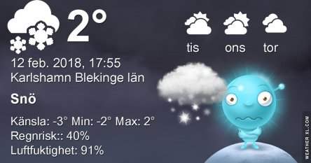
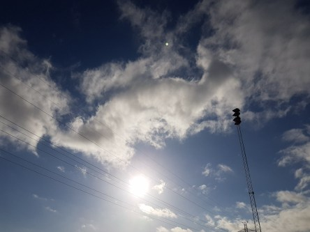
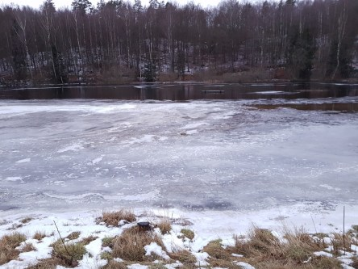

Idag går solen upp 07:34 och ned 16:56. Månen går upp 05:39 och ned 13:30 Månen är belyst 13 %. Dagens längd är 9 timmar och 22 minuter

 Molnigt 2,2 C  Vindby 4 m/s ENE  Luftfuktighet 88 %  hPa 992 Kl.02:20

 Molnigt och blåsigt 2 C  Vindby 7,5 m/s WNW  Luftfuktighet 83 %  hPa 992 Kl.07:20

 Molnigt och blåsigt 4,3 C  Vindby 4,6 m/s NE  Luftfuktighet 81 %  hPa 994 Kl.13:00

 Mest klart 0,7 C  Vindby 4,8 m/s NW  Luftfuktighet 78 %  hPa 999 Kl.20:05

 Regn, sol, blåsigt och kallt idag.

Högst och lägst uppmätta temperatur igår (inofficiellt privat mätare): Max 2,3 C , Min – 3,4 C Högst uppmätta vind 3,1 m/s. Högst uppmätta vindby 6,8 m/s.

Högst och lägst uppmätta temperatur igår (officiellt enligt [YR.NO](http://www.vackertvader.se/v%C3%A4derstation/karlshamn?utm_source=email&utm_medium=email&utm_campaign=asarum)) Max 2,3 C, Min – 5,9 C Högst uppmätta vind 4,2 m/s. Högst uppmätta vindby 9,8 m/s

 Solen visade sig en kort stund idag.

 Det är väldigt mycket vatten i ån just nu.

 Här har en sjö bildats där det egentligen skall vara en hästhage.

 Här ser man att ån nästan har nått upp till vägen.
