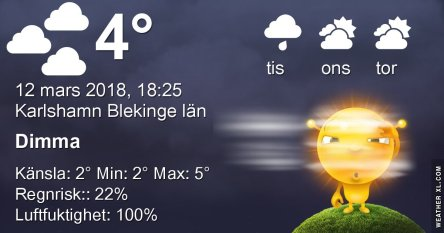
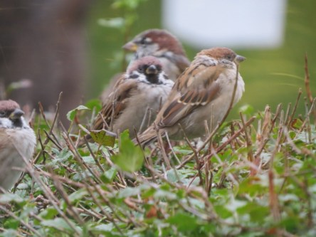
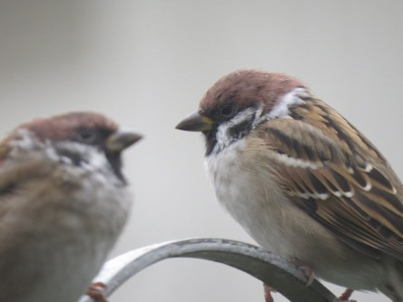

Idag går solen upp 06:25 och ned 17:57. Månen går upp 04:19 och ned 12:15 Månen är belyst 27 %. Dagens längd är 11 timmar och 32 minuter

 Molnigt 2,5 C  Vindby 1,2 m/s S  Luftfuktighet 97 %  hPa 992 Kl.01:30

 Dimma  2,2 C  Vindby 1,6 m/s SSE  Luftfuktighet 97 %  hPa 990 Kl.06:40

 Dimma  7,3 C  Vindby 2 m/s SE  Luftfuktighet 99 %  hPa 987 Kl.14:10

 Molnigt 3,3 C  Vindby 0,7 m/s SE  Luftfuktighet 99 %  hPa 986 Kl.20:00

 Dimma hela dagen.

Högst och lägst uppmätta temperatur igår (inofficiellt privat mätare): Max 3,7 C , Min – 3,4 C Högst uppmätta vind 2,7 m/s. Högst uppmätta vindby 5,4 m/s.

Högst och lägst uppmätta temperatur igår (officiellt enligt [YR.NO](http://www.vackertvader.se/v%C3%A4derstation/karlshamn?utm_source=email&utm_medium=email&utm_campaign=asarum)) Max 2,3 C, Min – 0,4 C Högst uppmätta vind 2,6 m/s. Högst uppmätta vindby 7,6 m/s

 Dessa mindre exotiska men ändå så charmiga pilfinkar och gråsparvar får representera dagens gråväder.
