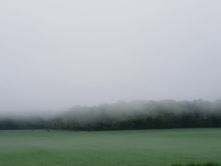
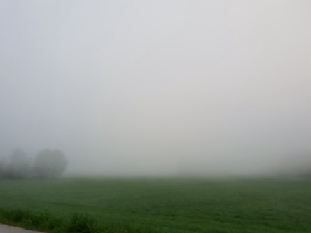

Idag går solen upp 04:53 och ned 21:01. Månen går upp 04:22 och ned 16:47 Månen är belyst 14 %. Dagens längd är 16 timmar och 8 minuter

 Mest molnigt 12,2 C  Vindstilla  Luftfuktighet 99 %  hPa 1014 Kl.02:25

 Tjock dimma  12 C  Vindby 0,3 m/s NE  Luftfuktighet 97 %  hPa 1015 Kl.06:25

 Molnigt 22,3 C  Vindby 1,7 m/s WNW  Luftfuktighet 70 %  hPa 1015 Kl.14:20

 Molnigt 13,2 C  Vindby 0,6 m/s S  Luftfuktighet 91 %  hPa 1015 Kl.19:45

 Efter en dimmig morgon blev det en härlig dag med lagom värme.

Högst och lägst uppmätta temperatur igår (inofficiellt privat mätare): Max 23 C , Min 11,7 C Högst uppmätta vind 4,1 m/s. Högst uppmätta vindby 6,8 m/s.

Högst och lägst uppmätta temperatur igår (officiellt enligt [YR.NO](http://www.vackertvader.se/v%C3%A4derstation/karlshamn?utm_source=email&utm_medium=email&utm_campaign=asarum)) Max 19,7 C, Min 11,5 C Högst uppmätta vind 2,3 m/s. Högst uppmätta vindby 7,8 m/s

 Tidig morgon med tät dimma i Asarum
