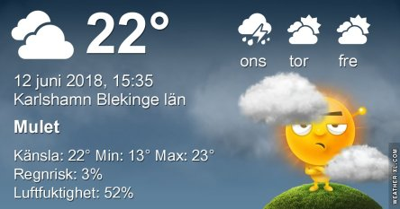

Idag går solen upp 04:13 och ned 21:48. Månen går upp 03:59 och ned 19:36 Det är gryning 03:11 och skymning 22:51 Månen är belyst 4 %. Dagens längd är 17 timmar och 35 minuter. Det är dagsljus 19 timmar och 40 minuter

 Molnigt 12,9 C  Vindby 4,6 m/s W  Luftfuktighet 83 %  hPa 1000 Kl.01:25

 Molnigt 14,5 C  Vindby 1 m/s WSW  Luftfuktighet 81 %  hPa 1001 Kl.06:25

 Molnigt 26,7 C  Vindby 2 m/s SW  Luftfuktighet 50 %  hPa 1002 Kl.14:50

 Mest molnigt 18,1 C  Vindby 1 m/s NE  Luftfuktighet 70 %  hPa 1003 Kl.21:00

 Svarta moln men inget regn!

Högst och lägst uppmätta temperatur igår (inofficiellt privat mätare): Max 25,9 C ( i solen ), Min 15,7 C Högst uppmätta vind 4,1 m/s. Högst uppmätta vindby 6,5 m/s

Högst och lägst uppmätta temperatur igår (officiellt enligt [YR.NO](http://www.vackertvader.se/v%C3%A4derstation/karlshamn?utm_source=email&utm_medium=email&utm_campaign=asarum)) Max 21,6 C, Min 13,7 C Högst uppmätta vind 3,7 m/s. Högst uppmätta vindby 9,2 m/s

 En gulsparv satt och sjöng högt upp på ett tak.

 Nyfiken kanin

 Med en mer skeptisk kompis.
