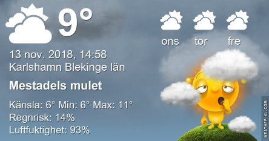
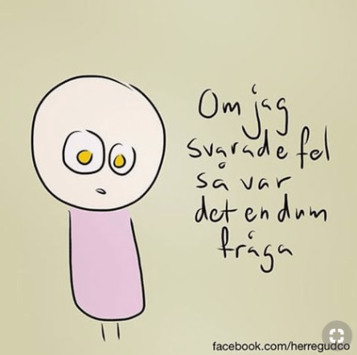
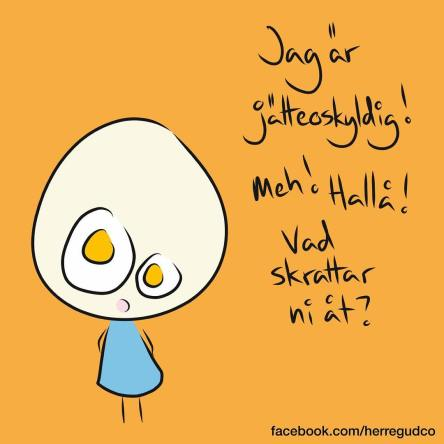
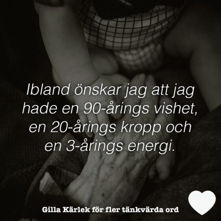

Idag går solen upp 07:34 och ned 15:56 Dagens längd är 8 timmar och 22 minuter. Det är gryning 06:51 och skymning 16:38 Det är dagsljus 9 timmar och 47 minuter. Månen går upp 12:50 och ned 20:29 Månen är belyst 27 %.

 Molnigt 9,7 C  Vindby 1,4 m/s WSW  Luftfuktighet 93 %  hPa 1009 Kl.02:00

 Mest molnigt 9 C  Vindby 2,2 m/s SSW  Luftfuktighet 93 %  hPa 1012 Kl.07:05

 Molnigt 10,9 C  Vindby 1,2 m/s E  Luftfuktighet 87 %  hPa 1013 Kl.14:15

 Mest molnigt 7,9 C  Vindby 1,4 m/s SE  Luftfuktighet 88 %  hPa 1014 Kl.21:00

 Tröttvädret håller i sig.

Högst och lägst uppmätta temperatur igår (inofficiellt privat mätare): Max 11,2 C , Min 8,3 C Högst uppmätta vind 1,7 m/s, Högst uppmätta vindby 4,1 m/s

Högst och lägst uppmätta temperatur igår (officiellt enligt [YR.NO](http://www.vackertvader.se/v%C3%A4derstation/karlshamn?utm_source=email&utm_medium=email&utm_campaign=asarum)) Max 9,7 C, Min 8,3 C Högst uppmätta vind 3,3 m/s. Högst uppmätta vindby 7,8 m/s

 Lite blandade visdomsord.
