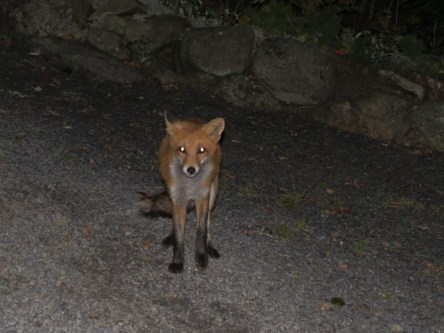
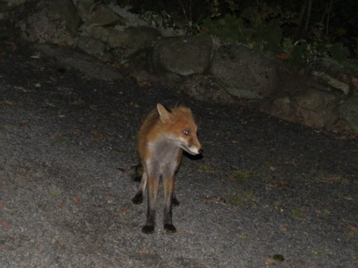

Idag går solen upp 06:22 och ned 17:59. Månen går upp 04:57 och ned 13:15 Månen är belyst 19 %. Dagens längd är 11 timmar och 42 minuter

 Regn 2,5 C  Vindby 0,4 m/s S  Luftfuktighet 96 %  hPa 984  Regn 0,7 mm Kl.01:20

 Regn 2,8 C  Vindby 1 m/s NNE  Luftfuktighet 97 %  hPa 984  Regn 7,2 mm Kl.06:25

 Molnigt 6,5 C  Vindby 2 m/s N  Luftfuktighet 93 %  hPa 989  Regn 12,2 mm Kl.14:20

 Molnigt 2,1 C  Vindby 0,8 m/s ENE  Luftfuktighet 89 %  hPa 995 Kl.21:20

 Blött och regn och extremt grått och trist idag igen. Och nu ska det bli kallare igen ovanpå allt. När kommer våren i år?

Högst och lägst uppmätta temperatur igår (inofficiellt privat mätare): Max 7,3 C , Min 2,2 C Högst uppmätta vind 2,7 m/s. Högst uppmätta vindby 5,4 m/s.

Högst och lägst uppmätta temperatur igår (officiellt enligt [YR.NO](http://www.vackertvader.se/v%C3%A4derstation/karlshamn?utm_source=email&utm_medium=email&utm_campaign=asarum)) Max 4,8 C, Min 2 C Högst uppmätta vind 1,9 m/s. Högst uppmätta vindby 4,8 m/s

 Tittar tillbaks på gamla bilder. De här är från en tidig morgon i september 2014.

 Den här räven stötte jag på några dagar senare samma månad.
