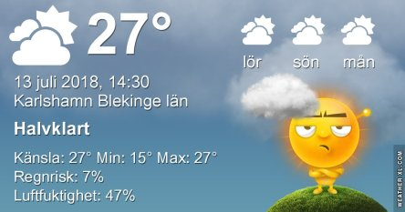

Idag går solen upp 04:31 och ned 21:41. Dagens längd är 17 timmar och 10 minuter. Det är gryning 03:33 och skymning 22:38 Det är dagsljus 19 timmar och 05 minuter. Månen går upp 05:00 och ned 21:44 Månen är belyst 0 %.

 Molnigt 14,6 C  Vindstilla  Luftfuktighet 99 %  hPa 1010 Kl.01:40

 Växlande molnighet 19,5 C  Vindby 0,3 m/s N  Luftfuktighet 85 %  hPa 1011 Kl.07:20

 Växlande molnighet 33,9 C   Vindby 1,4 m/s ESE  Luftfuktighet 29 %  hPa 1010 Kl.13:25

 Ökande molnighet 23,2 C  Vindby 0,3 m/s W  Luftfuktighet 57 %  hPa 1010 Kl.19:50

 Idag har det varit grymt varmt igen!

Högst och lägst uppmätta temperatur igår (inofficiellt privat mätare): Max 33,4 C  ( i solen ), Min 11,2 C Högst uppmätta vind 3,7  m/s. Högst uppmätta vindby 5,4  m/s

Högst och lägst uppmätta temperatur igår (officiellt enligt [YR.NO](http://www.vackertvader.se/v%C3%A4derstation/karlshamn?utm_source=email&utm_medium=email&utm_campaign=asarum)) Max 26,7 C, Min 10,8 C Högst uppmätta vind 3,5 m/s. Högst uppmätta vindby 8,1 m/s

 Ikväll var vi på Diggillo!
