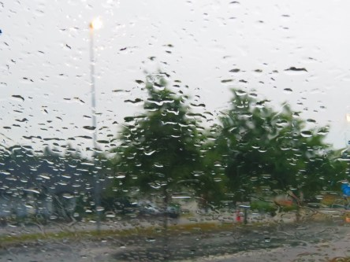
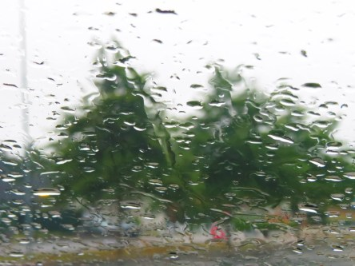

Idag går solen upp 05:26 och ned 20:43. Dagens längd är 15 timmar och 17 minuter. Det är gryning 04:42 och skymning 21:27 Det är dagsljus 16 timmar och 45 minuter. Månen går upp 08:01 och ned 21:46 Månen är belyst 4 %.

 Molnigt 10,7 C  Vindby 0,3 m/s NE  Luftfuktighet 97 %  hPa 1008 Kl.02:00

 Regn 11,5 C  Vindstilla  Luftfuktighet 97 %  hPa 1007  Regn 1 mm Kl.06:25

 Molnigt 17,5 C  Vindby 1,2 m/s WSW  Luftfuktighet 94 %  hPa 1007  Regn 4 mm Kl.14:10

 Molnigt 15,3 C  Vindstilla  Luftfuktighet 94 %  hPa 1005 Kl.19:55

 Nästan hela natten och större delen av dagen har det regnat. Inga större mängder dock eftersom det bara småregnar. Men så välkommet ändå.

Högst och lägst uppmätta temperatur igår (inofficiellt privat mätare): Max 25 C ( i solen ), Min 11,4 C Högst uppmätta vind 4,4 m/s. Högst uppmätta vindby 8,2 m/s

Högst och lägst uppmätta temperatur igår (officiellt enligt [YR.NO](http://www.vackertvader.se/v%C3%A4derstation/karlshamn?utm_source=email&utm_medium=email&utm_campaign=asarum)) Max 21,3 C, Min 11,4 C Högst uppmätta vind 4 m/s. Högst uppmätta vindby 11,3 m/s

 Solen gjorde ett försök på morgonen och färgade himlen rosa. Men det var lönlöst.

 För det var det här som vann kampen!!!
