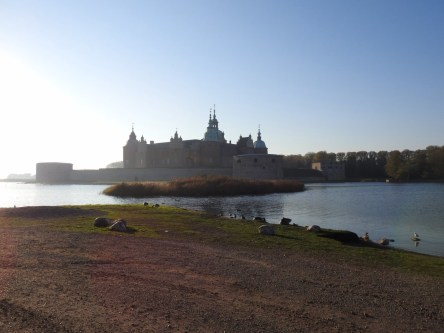
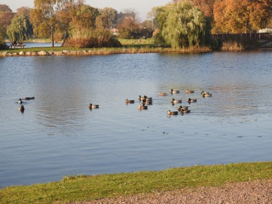
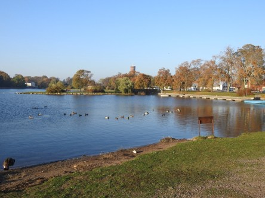
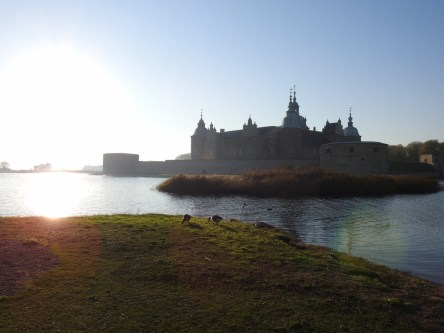
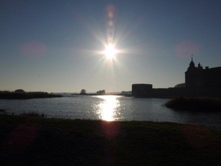

Idag går solen upp 07:30 och ned 18:02. Dagens längd är 10 timmar och 32 minuter. Det är gryning 06:52 och skymning 18:40 Det är dagsljus 11 timmar och 48 minuter. Månen går upp 13:29 och ned 21:02 Månen är belyst 27 %.

 Klart 8 C  Vindby 0,3 m/s W  Luftfuktighet 95 %  hPa 1018 Kl,.02:05

 Klart 4,4 C  Vindby 0,3 m/s NE  Luftfuktighet 96 %  hPa 1016 Kl.06:05

 Mest klart 19,6 C  Vindby 3,1 m/s NNW  Luftfuktighet 59 %  hPa 1013 Kl.14:00

 Mest klart 8,6 C  Vindby 0,3 m/s S  Luftfuktighet 87 %  hPa 1011 Kl.19:50

 Det blev ännu en fin sensommardag idag.

Högst och lägst uppmätta temperatur igår (inofficiellt privat mätare): Max 24 C , Min 4,1 C Högst uppmätta vind 2,4 m/s, Högst uppmätta vindby 3,4 m/s

Högst och lägst uppmätta temperatur igår (officiellt enligt [YR.NO](http://www.vackertvader.se/v%C3%A4derstation/karlshamn?utm_source=email&utm_medium=email&utm_campaign=asarum)) Max 17,8 C, Min  3,3 C Högst uppmätta vind 2,6 m/s. Högst uppmätta vindby 6,1 m/s

 Lite bilder från Kalmar slott idag och alla fåglar som finns där. Vitkindade gäss och änder.
