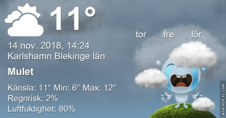

Idag går solen upp 07:36 och ned 15:54 Dagens längd är 8 timmar och 18 minuter. Det är gryning 06:53 och skymning 16:36 Det är dagsljus 9 timmar och 43 minuter. Månen går upp 13:22 och ned 21:33 Månen är belyst 36 %.

 Molnigt 8,1 C  Vindby 0,7 m/s SW  Luftfuktighet 92 %  hPa 1015 Kl.01:50

 Molnigt 6,3 C  Vindby 0,3 m/s S  Luftfuktighet 93 %  hPa 1017  Regn 1,2 mm Kl.06:30

 Mest molnigt 11,9 C  Vindby 0,7 m/s SE  Luftfuktighet 75 %  hPa 1021 Kl.13:50

 Molnigt 5,4 C  Vindby 0,3 m/s E  Luftfuktighet 88 %   hPa 1013 Kl.20:35

 För en snabb sekund tittade solen fram och man såg lite blå himmel. Men det gick så fort att man inte hann ut och njuta av det.

Högst och lägst uppmätta temperatur igår (inofficiellt privat mätare): Max 10,5 C , Min 7,4 C Högst uppmätta vind 1,7 m/s, Högst uppmätta vindby 2,4 m/s

Högst och lägst uppmätta temperatur igår (officiellt enligt [YR.NO](http://www.vackertvader.se/v%C3%A4derstation/karlshamn?utm_source=email&utm_medium=email&utm_campaign=asarum)) Max 9,6 C, Min 7,3 C Högst uppmätta vind 1,7 m/s. Högst uppmätta vindby 4,7 m/s

Bloggvännen Anki på Ankisbildblogg har lärt mig hur man gör sådana här collage så jag testar det för första gången nu. det ska bli kul med något nytt. Håll muspekaren på bilderna för att läsa texten.

\[gallery columns="2" link="file" size="medium" type="rectangular" ids="25430,25431,25432,25433,25434,25435,25436,25437,25438,25439,25440"\]
