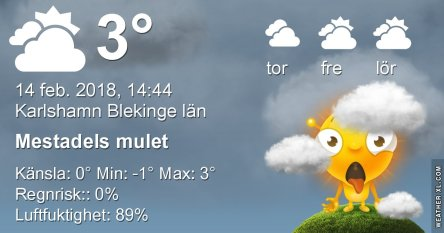
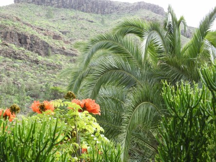
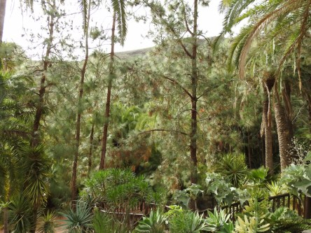
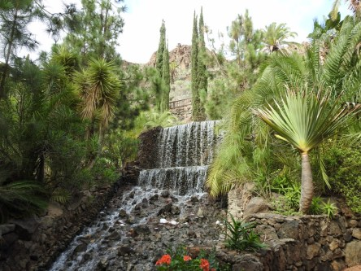

Idag går solen upp 07:29 och ned 17:01. Månen går upp 06:57 och ned 15:28 Månen är belyst 3 %. Dagens längd är 9 timmar och 32 minuter

 Mest molnigt - 0,2 C  Vindstilla  Luftfuktighet 95 %  hPa 1013 Kl.02:20

 Molnigt - 0,1 C  Vindstilla  Luftfuktighet 97 %  hPa 1015 Kl.07:00

 Mest molnigt 5,8 C  Vindby 2,2 m/s N  Luftfuktighet 79 %  hPa 1018 Kl.13:20

 Molnigt 0,3 C  Vindby 0,3 m/s SE  Luftfuktighet 89 %  hPa 1020 Kl.20:05

 Otroligt nog skymtade solen fram en stund idag.

Högst och lägst uppmätta temperatur igår (inofficiellt privat mätare): Max 5,7 C , Min – 2,6 C Högst uppmätta vind 2,7 m/s. Högst uppmätta vindby 4,8 m/s.

Högst och lägst uppmätta temperatur igår (officiellt enligt [YR.NO](http://www.vackertvader.se/v%C3%A4derstation/karlshamn?utm_source=email&utm_medium=email&utm_campaign=asarum)) Max 2 C, Min – 1 C Högst uppmätta vind 2,2 m/s. Högst uppmätta vindby 6,3 m/s

 Vädret är grått, maten i trädet är slut och fåglarna har flugit vidare. Då får man leta i arkivet efter något som piggar upp. Här är lite bilder från Maspalomas på Gran Canaria.
