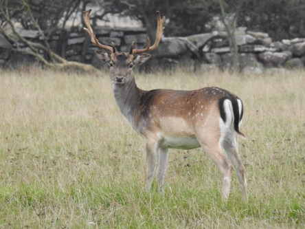

Idag går solen upp 06:19 och ned 18:01. Månen går upp 05:28 och ned 14:21 Månen är belyst 12 %. Dagens längd är 11 timmar och 42 minuter

 Regn 1,1 C  Vindby 0,4 m/s W  Luftfuktighet 92 %  hPa 999 Kl.01:20

 Molnigt 0,4 C  Vindby 1,4 m/s W  Luftfuktighet 96 %  hPa 1003   Regn 0,5 mm Kl.06:25

 Molnigt 0,9 C  Vindby 0,7 m/s S  Luftfuktighet 88 %  hPa 1008 Kl.13:35

 Molnigt - 1 C  Vindby 1,6 m/s E  Luftfuktighet 87 %  hPa 1012 Kl.19:55

 Fruktansvärt tröttsamt, grått och trist väder.

Högst och lägst uppmätta temperatur igår (inofficiellt privat mätare): Max 6,5 C , Min 1,9 C Högst uppmätta vind 1,4 m/s. Högst uppmätta vindby 5,6 m/s.

Högst och lägst uppmätta temperatur igår (officiellt enligt [YR.NO](http://www.vackertvader.se/v%C3%A4derstation/karlshamn?utm_source=email&utm_medium=email&utm_campaign=asarum)) Max 4,5 C, Min 1,6 C Högst uppmätta vind 2,1 m/s. Högst uppmätta vindby 4,8 m/s

 Minnen från Ottenby på Öland.
