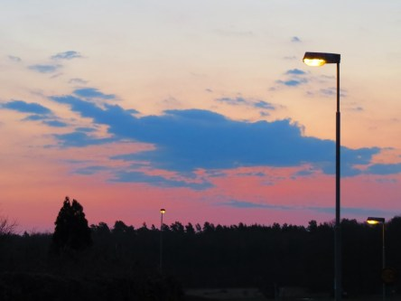

Idag går solen upp 05:58 och ned 20:04. Månen går upp 05:59 och ned 17:54 Månen är belyst 5 %. Dagens längd är 14 timmar och 6 minuter

 Halvklart 7,4 C  Vindby 3,8 m/s NE  Luftfuktighet 74 %  hPa 1010 Kl.02:25

 Växlande molnighet 5,6 C  Vindby 1,8 m/s NW  Luftfuktighet 83 %  hPa 1010 Kl.06:45

 Tunna slöjmoln 20 C  Vindby 5 m/s E  Luftfuktighet 56 %  hPa 1012 Kl.14:05

 Molnigt 8 C  Vindby 2,8 m/s E  Luftfuktighet 92 %  hPa 1012 Kl.19:55

 Soligt, varmt och härligt idag.

Högst och lägst uppmätta temperatur igår (inofficiellt privat mätare): Max 19,3 C , Min 3,3 C Högst uppmätta vind ? m/s. Högst uppmätta vindby 12,4 m/s.

Högst och lägst uppmätta temperatur igår (officiellt enligt [YR.NO](http://www.vackertvader.se/v%C3%A4derstation/karlshamn?utm_source=email&utm_medium=email&utm_campaign=asarum)) Max 15,7 C, Min 5,4 C Högst uppmätta vind 5,2 m/s. Högst uppmätta vindby 12,6 m/s

 Dagens soluppgång.

 Idag var det äntligen dags att släppa ut mina sköldpaddor på sommarbete.
