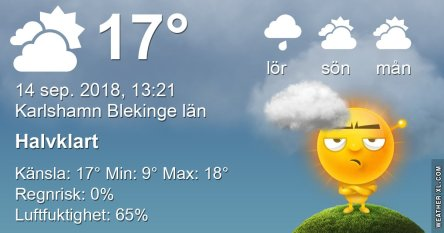
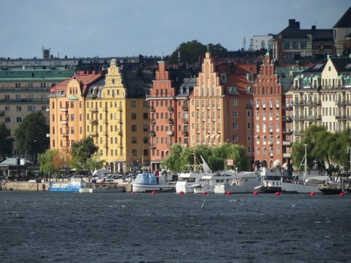
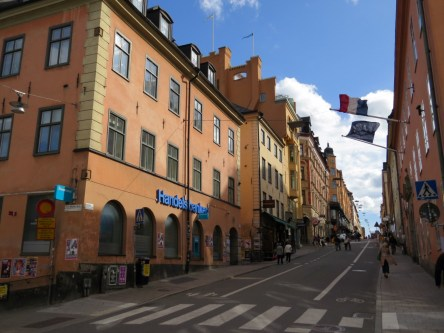
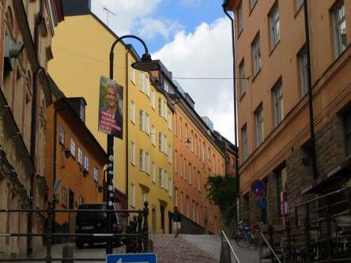
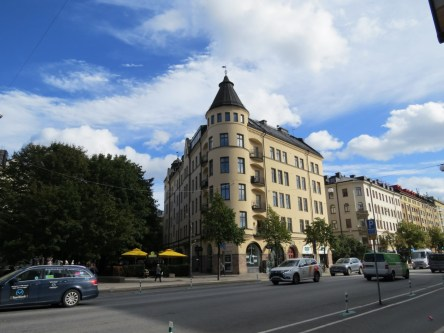
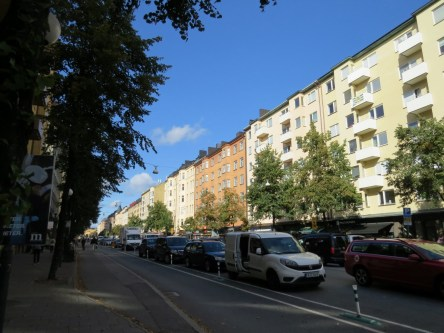

Idag går solen upp 06:30 och ned 19:22. Dagens längd är 12 timmar och 52 minuter. Det är gryning 05:52 och skymning 19:59 Det är dagsljus 14 timmar och 07 minuter. Månen går upp 12:18 och ned 21:29 Månen är belyst 23 %.

 Växlande molnighet 8,9 C  Vindstilla  Luftfuktighet 91 %  hPa 1014 Kl.02:20

 Växlande molnighet 4,7 C  Vindstilla  Luftfuktighet 98 %  hPa 1013 Kl.06:45

 Växlande molnighet 24,2 C  Vindby 4,8 m/s E  Luftfuktighet 45 %  hPa 1014 Kl.13:50

 Molnigt 13,3 C  Vindby 1,4 m/s S  Luftfuktighet 76 %  hPa 1013 Kl.19:50

 Mörka moln men inget regn syns till, suck!

Högst och lägst uppmätta temperatur igår (inofficiellt privat mätare): Max 24,7 C , Min 9,5 C Högst uppmätta vind 2,7 m/s. Högst uppmätta vindby 4,8 m/s

Högst och lägst uppmätta temperatur igår (officiellt enligt [YR.NO](http://www.vackertvader.se/v%C3%A4derstation/karlshamn?utm_source=email&utm_medium=email&utm_campaign=asarum)) Max 18,4 C, Min 7,6 C Högst uppmätta vind 3,2 m/s. Högst uppmätta vindby 7,2 m/s

 En salig Stockholmsblandning del 1. Det här är lite bilder från vår tripp till Stockholm med kända och okända motiv.
