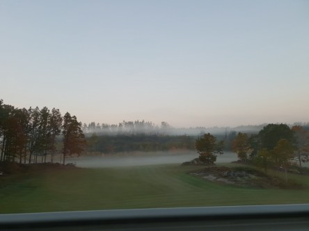
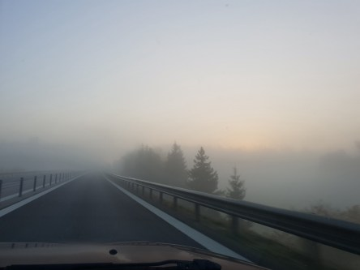
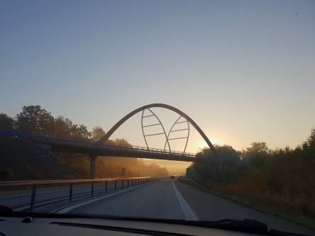
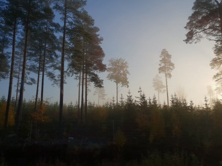
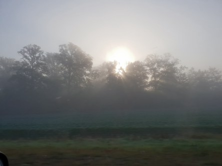
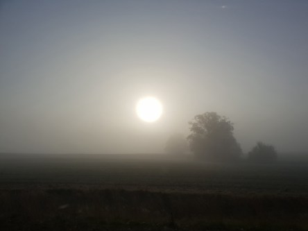
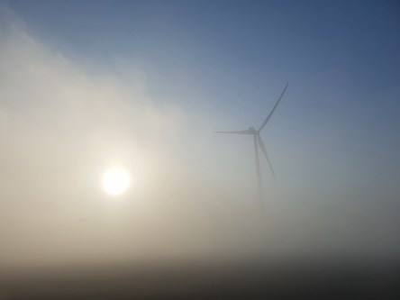
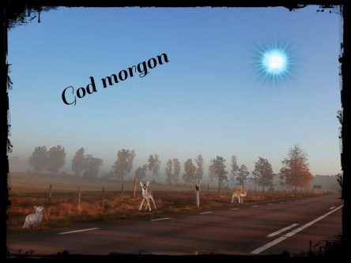

Idag går solen upp 07:32 och ned 18:00. Dagens längd är 10 timmar och 28 minuter. Det är gryning 06:54 och skymning 18:38 Det är dagsljus 11 timmar och 44 minuter. Månen går upp 14:25 och ned 21:48 Månen är belyst 34 %.

 Klart 4,9 C  Vindby 0,3 m/s S  Luftfuktighet 94 %  hPa 1011 Kl.02:10

 Mest klart 3,4 C  Vindstilla  Luftfuktighet 96 %  hPa 1011 Kl.06:30

 Mest klart 20,4 C  Vind2,4 m/s WSW  Luftfuktighet 54 %  hPa 1012 Kl.14:10

 Mest klart 6,6 C  Vindby 0,3 m/s NW  Luftfuktighet 89 %  hPa 1012 Kl.19:50

 Ännu en fin dag med lagom varmt. Men snart är det slut med det och kylan kommer ner över landet.

Högst och lägst uppmätta temperatur igår (inofficiellt privat mätare): Max 20,1 C , Min 4,3 C Högst uppmätta vind 2 m/s, Högst uppmätta vindby 4,1 m/s

Högst och lägst uppmätta temperatur igår (officiellt enligt [YR.NO](http://www.vackertvader.se/v%C3%A4derstation/karlshamn?utm_source=email&utm_medium=email&utm_campaign=asarum)) Max 16 C, Min  1,5 C Högst uppmätta vind 4,1 m/s. Högst uppmätta vindby 7,5 m/s

 Det var en dimmig morgon när vi körde till Kalmar i helgen. Soluppgången var helt otrolig men tyvärr kunde jag inte ta några bilder från bilen eftersom vindrutans alla prickar blev det kameran fokuserade på 😟

 Och självklart måste jag leka med en av bilderna.
