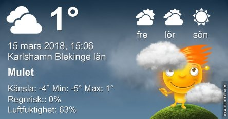

Idag går solen upp 06:17 och ned 18:03. Månen går upp 05:54 och ned 15:31 Månen är belyst 6 %. Dagens längd är 11 timmar och 46 minuter

 Molnigt - 2,6 C  Vindby 0,8 m/s N  Luftfuktighet 87 %  hPa 1013 Kl.01:45

 Molnigt - 2,9 C  Vindby 1,6 m/s N  Luftfuktighet 75 %  hPa 1013 Kl.04:40

 Molnigt 0,6 C  Vindby 4,1 m/s S  Luftfuktighet 58 %  hPa 1013 Kl.13:50

 Växlande molnighet - 2,8 C  Vindby 6,6 m/s NE  Luftfuktighet 61 %  hPa 1015 Kl.19:55

 Grått och blåsigt hela dagen.

Högst och lägst uppmätta temperatur igår (inofficiellt privat mätare): Max 2,3 C , Min - 4,5 C Högst uppmätta vind 3,1 m/s. Högst uppmätta vindby 5,4 m/s.

Högst och lägst uppmätta temperatur igår (officiellt enligt [YR.NO](http://www.vackertvader.se/v%C3%A4derstation/karlshamn?utm_source=email&utm_medium=email&utm_campaign=asarum)) Max 0,7 C, Min - 3,1 C Högst uppmätta vind 1,8 m/s. Högst uppmätta vindby 4,3 m/s

 Kärt besök i trädgården idag igen.
