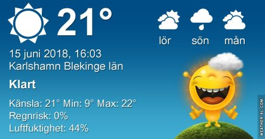
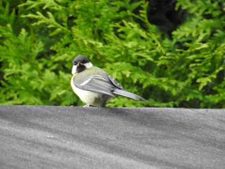

Idag går solen upp 04:12 och ned 21:50. Månen går upp 06:14 och ned 23:05 Det är gryning 03:09 och skymning 22:54 Månen är belyst 2 %. Dagens längd är 17 timmar och 38 minuter. Det är dagsljus 19 timmar och 45 minuter

 Molnigt 14,9 C  Vindby 1,4 m/s W  Luftfuktighet 76 %  hPa 1008 Kl.02:20

 Mest molnigt 18,1 C  Vindby 1,7 m/s SW  Luftfuktighet 78 %  hPa 1009 Kl.06:55

 Växlande molnigt 22,9 C  Vindby 3 m/s SSE  Luftfuktighet 54 %  hPa 1012 Kl.15:45

 Tunna slöjmoln 19,5 C  Vindby 1,4 m/s S  Luftfuktighet 36 %  hPa 1012 Kl.19:55

 Dagen började bra med mörka moln och några droppar regn. Sen började det blåsa och solen kom fram igen. Det känns hopplöst.

Högst och lägst uppmätta temperatur igår (inofficiellt privat mätare): Max 26,1 C ( i solen ), Min 8,8 C Högst uppmätta vind 4,1 m/s. Högst uppmätta vindby 8,4 m/s

Högst och lägst uppmätta temperatur igår (officiellt enligt [YR.NO](http://www.vackertvader.se/v%C3%A4derstation/karlshamn?utm_source=email&utm_medium=email&utm_campaign=asarum)) Max 19,7 C, Min 8,5 C Högst uppmätta vind 3,9 m/s. Högst uppmätta vindby 8,4 m/s

 Här är det massor av små talgoxeungar som kommer och äter varje dag. Den tycks inte uppskatta att bli fotograferad.
