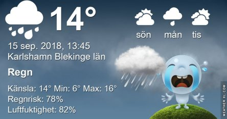
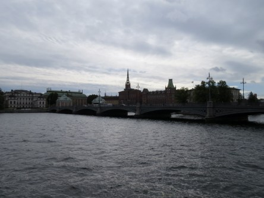
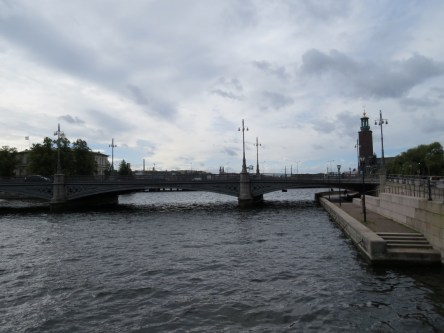

Idag går solen upp 06:32 och ned 19:19. Dagens längd är 12 timmar och 47 minuter. Det är gryning 05:54 och skymning 19:57 Det är dagsljus 14 timmar och 03 minuter. Månen går upp 13:31 och ned 21:56 Månen är belyst 32 %.

 Molnigt 13,1 C  Vindby 3 m/s NE  Luftfuktighet 76 %   hPa 1011 Kl.02:25

 Molnigt 11,6 C  Vindby 1,4 m/s NNW  Luftfuktighet 79 %  hPa 1009 Kl.06:25

 Regnskurar 19,3 C  Vindby 4,2 m/s  m/s S  Luftfuktighet 64 %  hPa 1011  Regn 1,5 mm Kl.14:20

 Halvklart 10,4 C  Vindby 1,2 m/s NNE  Luftfuktighet 72 %  hPa 1014  Regn 2 mm KL.19:45

 Det kom 2 mm, sen var det sol igen!!!! Jag hann inte ens ut och ta några bilder!

Högst och lägst uppmätta temperatur igår (inofficiellt privat mätare): Max 24,2 C , Min 4,8 C Högst uppmätta vind 3,7 m/s. Högst uppmätta vindby 5,4 m/s

Högst och lägst uppmätta temperatur igår (officiellt enligt [YR.NO](http://www.vackertvader.se/v%C3%A4derstation/karlshamn?utm_source=email&utm_medium=email&utm_campaign=asarum)) Max ? C, Min ? C Högst uppmätta vind ? m/s. Högst uppmätta vindby ? m/s

 En salig Stockholmsblandning del 2. Känt och okänt i Stockholm.

 Det känns som att alla har bråttom nuförtiden!
