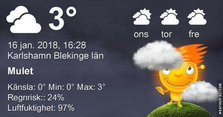
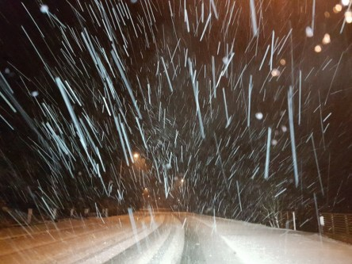
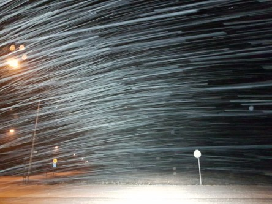

Idag går solen upp 08:22 och ned 15:59. Månen går upp 07:43 och ned 15:36 Månen är belyst 1 %. Dagens längd är 7 timmar och 37 minuter

 Blåsigt 0,7 C  Vindby 8 m/s E  Luftfuktighet 84 %  hPa 990 Kl.01:40

 Regn och blåst 0,2 C  Vindby 7,1 m/s W  Luftfuktighet 97 %  hPa 983  Regn/snö 1,7 mm Kl.06:35

 Molnigt 4,1 C  Vindby 2 m/s WNW  Luftfuktighet 99 %  hPa 980  Snö/regn 11,2 mm Kl.14:45

 Molnigt - 0,2 C  Vindstilla  Luftfuktighet 97 %  hPa 979  Regn/snö 14,5 mm Kl.20:45

 Riktigt oväder inatt med snöstorm och halka.

Högst och lägst uppmätta temperatur igår (inofficiellt privat mätare): Max 1,9 C , Min – 2,5 C Högst uppmätta vind 4,4 m/s. Högst uppmätta vindby 8,2 m/s.

Högst och lägst uppmätta temperatur igår (officiellt enligt [YR.NO](http://www.vackertvader.se/v%C3%A4derstation/karlshamn?utm_source=email&utm_medium=email&utm_campaign=asarum)) Max 1,3 C, Min – 1,8 C Högst uppmätta vind 5,2 m/s. Högst uppmätta vindby 13 m/s

 Ett rejält snöoväder drog in över oss inatt. Det snöade vågrätt bitvis.
