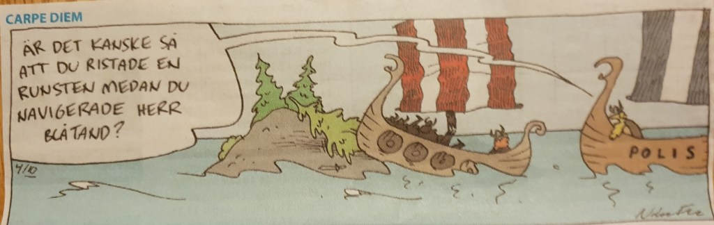
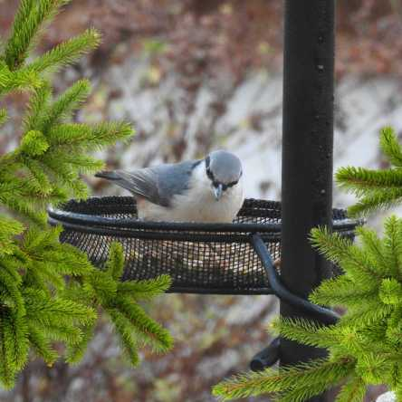
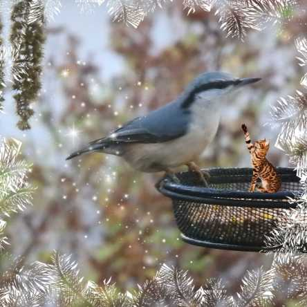

Idag går solen upp 07:40 och ned 15:50 Dagens längd är 8 timmar och 10 minuter. Det är gryning 06:57 och skymning 16:33 Det är dagsljus 9 timmar och 36 minuter. Månen går upp 14:09 och ned 23:50 Månen är belyst 55 %.

 Disigt 7,2 C  Vindby 2,4 m/s W  Luftfuktighet 91 %  hPa 1031 Kl.02:15

 Mest klart 3 C  Vindby 0,3 m/s SW  Luftfuktighet 94 %  hPa 1032 Kl.06:40

 Halvklart 12,1 C  Vindby 1 m/s NE  Luftfuktighet 64 %  hPa 1034 Kl.14:25

 Växlande molnighet 1,6 C  Vindstilla  Luftfuktighet 92 %  hPa 1035 Kl.19:50

 Äntligen fick vi se solen igen! Men nu är det kallt som gäller.

Högst och lägst uppmätta temperatur igår (inofficiellt privat mätare): Max 10,2 C , Min 5,2 C Högst uppmätta vind 1,4 m/s, Högst uppmätta vindby 2,4 m/s

Högst och lägst uppmätta temperatur igår (officiellt enligt [YR.NO](http://www.vackertvader.se/v%C3%A4derstation/karlshamn?utm_source=email&utm_medium=email&utm_campaign=asarum)) Max 9 C, Min 6,3 C Högst uppmätta vind 2 m/s. Högst uppmätta vindby 5,9 m/s

 Surf bakom ratten är tydligen inget nytt fenomen 😂

 Idag fick jag besök av min vän nötväckan. Bilderna är tagna genom köksfönstret och blev inte världens bästa, men med lite effekter så blev dem lite roligare och piggare.
