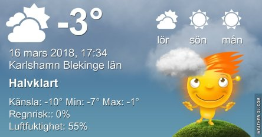
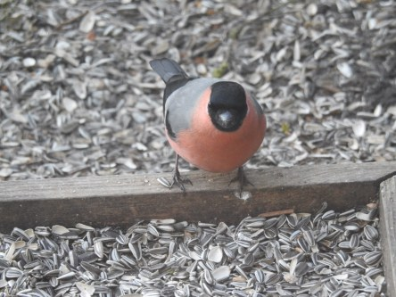
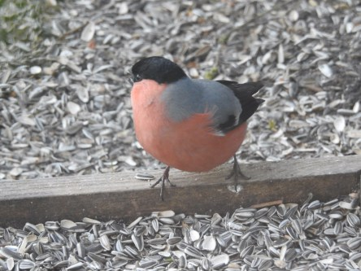
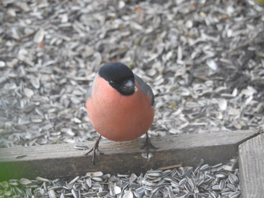
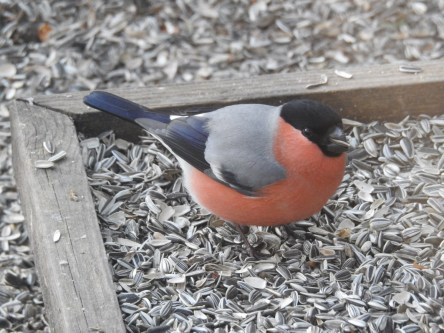
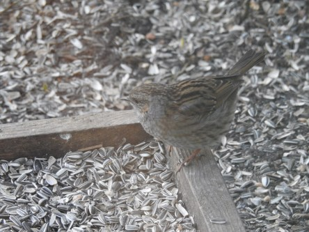

Idag går solen upp 06:14 och ned 18:05. Månen går upp 06:16 och ned 16:44 Månen är belyst 2 %. Dagens längd är 11 timmar och 51 minuter

 Halvklart - 4,9 C  Vindby 5,6 m/s EN  Luftfuktighet 51 %  hPa 1015 Kl.01:00

 Växlande molnighet och lätt snö - 5,9 C  Vindby 4 m/s NW  Luftfuktighet 68 %  hPa 1015 Kl.06:50

 Växlande molnighet - 0,2 C  Vindby 4,1 m/s SSE  Luftfuktighet 36 %  hPa 1017 Kl.13:50

 Mest klart - 7,3 C  Vindby 2,8 m/s ESE  Luftfuktighet 68 %  hPa 1019 Kl.19:50

 Idag har det varit blåsigt, kallt, snöyra men också mycket sol.

Högst och lägst uppmätta temperatur igår (inofficiellt privat mätare): Max 1,4 C , Min – 2,9 C Högst uppmätta vind 3,7 m/s. Högst uppmätta vindby 7,8 m/s.

Högst och lägst uppmätta temperatur igår (officiellt enligt [YR.NO](http://www.vackertvader.se/v%C3%A4derstation/karlshamn?utm_source=email&utm_medium=email&utm_campaign=asarum)) Max - 0,1 C, Min – 3,2 C Högst uppmätta vind 3,5 m/s. Högst uppmätta vindby 9,7 m/s

 Ett kärt återbesök i trädgården idag. Inte bästa skärpan på bilderna eftersom de är tagna genom allt annat än rena köksfönster.

 Och en daglig gäst som är väldigt svår att få bra bilder på eftersom den är väldigt skygg och aldrig stilla. Järnsparven.
