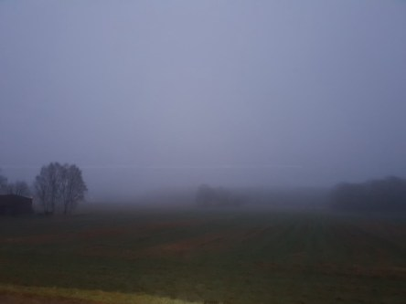
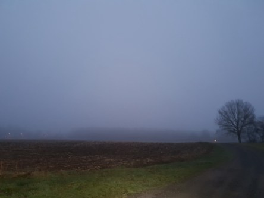

Idag går solen upp 05:53 och ned 20:09. Månen går upp 06:37 och ned 20:33 Månen är belyst 0 %. Dagens längd är 14 timmar och 16 minuter

 Växlande molnighet 5,1 C  Vindby 0,7 m/s W  Luftfuktighet 98 %  hPa 1009 Kl.02:30

 Dimma  6,3 C  Vindby 1,4 m/s W  Luftfuktighet 97 %  hPa 1008 Kl.06:35

 Molnigt 19,1 C  Vindby 1,8 m/s W  Luftfuktighet 69 %   hPa 1009 Kl.13:00

 Växlande molnighet 10,9 C  Vindstilla  Luftfuktighet 81 %  hPa 1011 Kl.20:20

 Idag har det varit grått väder mesta tiden.

Högst och lägst uppmätta temperatur igår (inofficiellt privat mätare): Max 12,3 C , Min 3,9 C Högst uppmätta vind 1 m/s. Högst uppmätta vindby 2,7 m/s.

Högst och lägst uppmätta temperatur igår (officiellt enligt [YR.NO](http://www.vackertvader.se/v%C3%A4derstation/karlshamn?utm_source=email&utm_medium=email&utm_campaign=asarum)) Max 8,2 C, Min 4,2 C Högst uppmätta vind 2,5 m/s. Högst uppmätta vindby 5 m/s

 En väldigt dimmig morgon.

 Fick besök av min lilla entita idag.

 Dagen avslutades betydligt färgrikare än den började.
