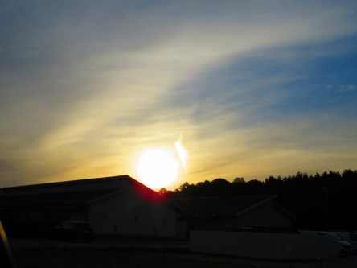
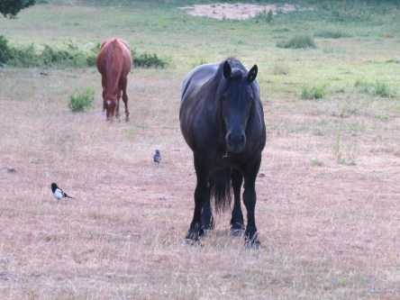

Idag går solen upp 04:12 och ned 21:51. Månen går upp 07:24 och ned 23:52 Det är gryning 03:09 och skymning 22:54 Månen är belyst 8 %. Dagens längd är 17 timmar och 39 minuter. Det är dagsljus 19 timmar och 45 minuter

 Halvklart 5,5 C  Vindstilla  Luftfuktighet 89 %  hPa 1014 Kl.02:20

 Mest klart 20,1 C  Vindby 0,7 m/s S  Luftfuktighet 53 %  hPa 1015 Kl.07:30

 Molnigt 24,7 C  Vindby 2,6 m/s WNW  Luftfuktighet 38 %  hPa 1014 Kl.15:20

 Växlande molnighet 18,6 C  Vindby 1,7 m/s SE  Luftfuktighet 52 %  hPa 1013 Kl.19:45

 Härligt molnigt och svalt idag. Men inget regn ännu.

Högst och lägst uppmätta temperatur igår (inofficiellt privat mätare): Max 25,4 C ( i solen ), Min 8,2 C Högst uppmätta vind 3,4 m/s. Högst uppmätta vindby 7,1 m/s

Högst och lägst uppmätta temperatur igår (officiellt enligt [YR.NO](http://www.vackertvader.se/v%C3%A4derstation/karlshamn?utm_source=email&utm_medium=email&utm_campaign=asarum)) Max 22,4 C, Min 6,5 C Högst uppmätta vind 3,6 m/s. Högst uppmätta vindby 8,8 m/s

 Soluppgång och morgonpigga djur som njuter av lugnet innan alla andra vaknar.
