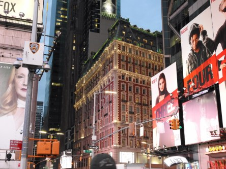
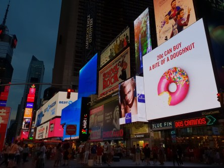
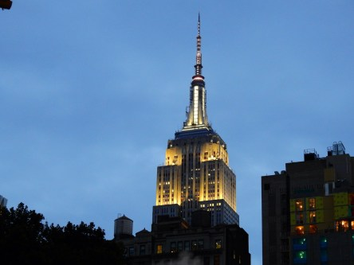

Idag går solen upp 04:35 och ned 21:37. Dagens längd är 17 timmar och 02 minuter. Det är gryning 03:39 och skymning 22:33 Det är dagsljus 18 timmar och 54 minuter. Månen går upp 09:05 och ned 23:22 Månen är belyst 13 %.

 Halvklart 15,4 C  Vindstilla  Luftfuktighet 80 %  hPa 1011 Kl.02:25

 Klart 23,9 C  Vindby 1,4 m/s SW  Luftfuktighet 51 %  hPa 1011 Kl.07:30

 Klart 32,6 C  Vindby 4 m/s SSE  Luftfuktighet 27 %  hPa 1010 Kl.13:30

 Tunna moln 25,3 C  Vindby 1,7 m/s SW  Luftfuktighet 28 %  hPa 1009 Kl.19:50

 Jag hoppas att det utlovade regnet kommer och att det blir mer än några droppar den här gången.

Högst och lägst uppmätta temperatur igår (inofficiellt privat mätare): Max 38,3 C  ( i solen ), Min 13,5 C Högst uppmätta vind 3,7  m/s. Högst uppmätta vindby 5,8  m/s

Högst och lägst uppmätta temperatur igår (officiellt enligt [YR.NO](http://www.vackertvader.se/v%C3%A4derstation/karlshamn?utm_source=email&utm_medium=email&utm_campaign=asarum)) Max 28,9 C, Min 13,3 C Högst uppmätta vind 3,5 m/s. Högst uppmätta vindby 8,8 m/s

 Några kvällsbilder från Manhattan. Det här är Times Square som jag anser är väldigt överskattat. Det är mest trångt och stökigt.

 Empire State Building.

 Chrysler Building.

 Grand Central Station.
