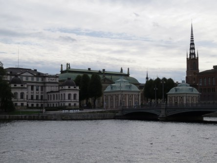
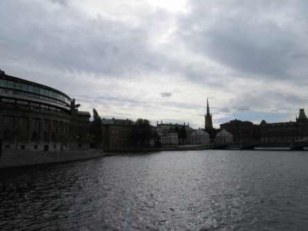
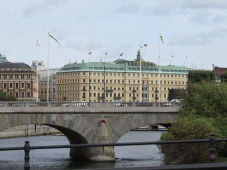
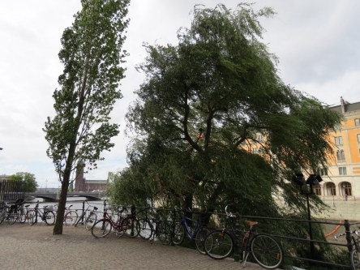
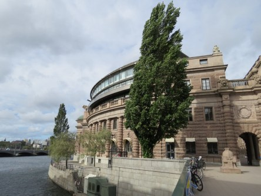

Idag går solen upp 06:34 och ned 19:16. Dagens längd är 12 timmar och 42 minuter. Det är gryning 05:56 och skymning 19:54 Det är dagsljus 13 timmar och 58 minuter. Månen går upp 14:38 och ned 22:29 Månen är belyst 41 %.

 Mest klart 3,6 C  Vindstilla  Luftfuktighet 99 %   hPa 1016 Kl.01:30

 Mest klart 5,6 C  Vindstilla  Luftfuktighet 99 %  hPa 1018 Kl.07:45

 Växlande molnighet 20,4 C  Vindby 4,2 m/s NNE  Luftfuktighet 49 %  hPa 1017 Kl.13:30

 Molnigt 13 C  Vindby 2,2 m/s NNE  Luftfuktighet 79 %  hPa 1015 Kl.19:45

 Fortfarande inget regn!

Högst och lägst uppmätta temperatur igår (inofficiellt privat mätare): Max 19,7 C , Min 4,7 C Högst uppmätta vind 3,1 m/s. Högst uppmätta vindby 6,5 m/s

Högst och lägst uppmätta temperatur igår (officiellt enligt [YR.NO](http://www.vackertvader.se/v%C3%A4derstation/karlshamn?utm_source=email&utm_medium=email&utm_campaign=asarum)) Max ? C, Min ? C Högst uppmätta vind ? m/s. Högst uppmätta vindby ? m/s

 En salig Stockholmsblandning del 3. Runt omkring Rosenbad en blåsig dag.
