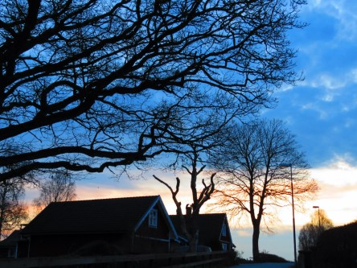
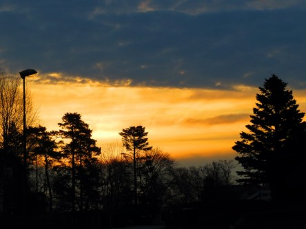

Idag går solen upp 05:50 och ned 20:11. Månen går upp 06:59 och ned 21:54 Månen är belyst 1 %. Dagens längd är 14 timmar och 21 minuter

 Halvklart 2,7 C  Vindby 0,3 m/s SE  Luftfuktighet 99 %  hPa 1013 Kl.02:30

 Växlande molnighet 5,8 C  Vindstilla  Luftfuktighet 98 %  hPa 1015 Kl.07:20

 Mest molnigt 18,1 C  Vindby 2,8 m/s SW  Luftfuktighet 73 %  hPa 1018 Kl.14:00

 Växlande molnighet 9,3 C  Vindby 0,7 m/s E  Luftfuktighet 71 %  hPa 1021 Kl.20:00

 Efter en kall natt och grå morgon så kom solen fram och det blev en härlig och varm dag igen.

Högst och lägst uppmätta temperatur igår (inofficiellt privat mätare): Max 20,5 C , Min 5,1 C Högst uppmätta vind 1,7 m/s. Högst uppmätta vindby 2,7 m/s.

Högst och lägst uppmätta temperatur igår (officiellt enligt [YR.NO](http://www.vackertvader.se/v%C3%A4derstation/karlshamn?utm_source=email&utm_medium=email&utm_campaign=asarum)) Max 16,1 C, Min 3,4 C Högst uppmätta vind 3 m/s. Högst uppmätta vindby 5,9 m/s

 Idag fick solen kämpa mot mörka hotfulla moln på morgonen.
