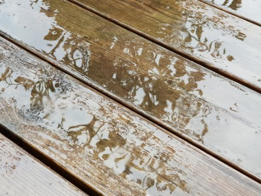

Idag går solen upp 04:12 och ned 21:51. Månen går upp 08:38 och ned 00:36 Det är gryning 03:08 och skymning 22:55 Månen är belyst 15 %. Dagens längd är 17 timmar och 39 minuter. Det är dagsljus 19 timmar och 47 minuter

 Lätt regn 14,5 C  Vindby 1,7 m/s SW  Luftfuktighet 79 %  hPa 1012 Kl.02:15

 Regn 16,3 C  Vindby 0,3 m/s E  Luftfuktighet 91 %  hPa 1009  Regn 2,4 mm Kl.07:30

 Växlande molnighet 26,7 C  Vindby 3,7 m/s SW  Luftfuktighet 70 %  hPa 1008  Regn 7,7 mm Kl.13:50

 Mest molnigt 18,8 C  Vindby 2,7 m/s N  Luftfuktighet 42 %  hPa 1010 Kl.20:05

 Idag kom det äntligen lite regn. Och behagligare temperatur.

Högst och lägst uppmätta temperatur igår (inofficiellt privat mätare): Max 27,4 C ( i solen ), Min 5,3 C Högst uppmätta vind 2,7 m/s. Högst uppmätta vindby 3,7 m/s

Högst och lägst uppmätta temperatur igår (officiellt enligt [YR.NO](http://www.vackertvader.se/v%C3%A4derstation/karlshamn?utm_source=email&utm_medium=email&utm_campaign=asarum)) Max 21,6 C, Min 5,5 C Högst uppmätta vind 3,3 m/s. Högst uppmätta vindby 7 m/s

 Vilken härlig syn med regn.
