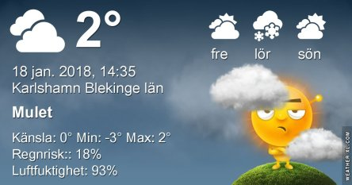

Idag går solen upp 08:19 och ned 16:02. Månen går upp 08:55 och ned 17:39 Månen är belyst 1 %. Dagens längd är 7 timmar och 43 minuter

 Molnigt 0,3 C  Vindstilla  Luftfuktighet 95 %  hPa 989 Kl.02:05

 Växlande molnighet - 1,3 C  Vindstilla  Luftfuktighet 98 %  hPa 988 Kl.07:10

 Molnigt 1,6 C  Vindby 2 m/s W  Luftfuktighet 93 %  hPa 984 Kl.14:35

 Växlande molnighet 0 C  Vindby 1,4 m/s SW  Luftfuktighet 96 %  hPa 986 Kl.20:00

 Kallt och grått hela dagen.

Högst och lägst uppmätta temperatur igår (inofficiellt privat mätare): Max 5,3 ( i solen ) C , Min – 0,7 C Högst uppmätta vind 1,7 m/s. Högst uppmätta vindby 2,7 m/s.

Högst och lägst uppmätta temperatur igår (officiellt enligt [YR.NO](http://www.vackertvader.se/v%C3%A4derstation/karlshamn?utm_source=email&utm_medium=email&utm_campaign=asarum)) Max 2,1 C, Min – 1 C Högst uppmätta vind 1,5 m/s. Högst uppmätta vindby 5,1 m/s

 Det trista kalla gråvädret gör att man får leva på minnen. Den här lilla tvättbjörnen som kom gående över vägen och helt lugnt klättrade upp i ett träd i New York är ett sånt minne som piggar upp just nu.
