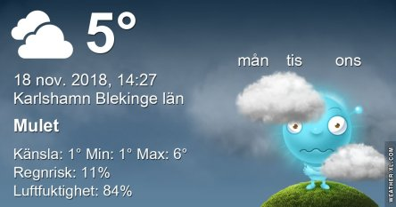

Idag går solen upp 07:44 och ned 15:47 Dagens längd är 8 timmar och 03 minuter. Det är gryning 07:01 och skymning 16:30 Det är dagsljus 9 timmar och 29 minuter. Månen går upp 14:44 och ned 01:00 Månen är belyst 72 %.

 Molnigt 3,3 C  Vindby 0,4 m/s N  Luftfuktighet 82 %  hPa 1033 Kl.01:30

 Halvklart 1,1 C  Vindby 0,3 m/s NW  Luftfuktighet 92 %  hPa 1030 Kl.07:05

 Molnigt 6,8 C  Vindby 3,6 m/s SSW  Luftfuktighet 74 %  hPa 1030 Kl.13:50

 Mest molnigt 3,6 C  Vindby 3,8 m/s N  Luftfuktighet 80 %  hPa 1030 Kl.19:45

 Grått och ruggigt och kallt är vad som gäller nu.

Högst och lägst uppmätta temperatur igår (inofficiellt privat mätare): Max 6,9 C , Min 3,3 C Högst uppmätta vind 1,4 m/s, Högst uppmätta vindby 2,7 m/s

Högst och lägst uppmätta temperatur igår (officiellt enligt [YR.NO](http://www.vackertvader.se/v%C3%A4derstation/karlshamn?utm_source=email&utm_medium=email&utm_campaign=asarum)) Max 5,7 C, Min 3,8 C Högst uppmätta vind 1,9 m/s. Högst uppmätta vindby 5,2 m/s

 Kloka ord för valda tillfällen. Måste säga att det sista gäller mig i allra högsta grad.

 En blomma till alla som tittar in här. Ha en trevlig kväll!
